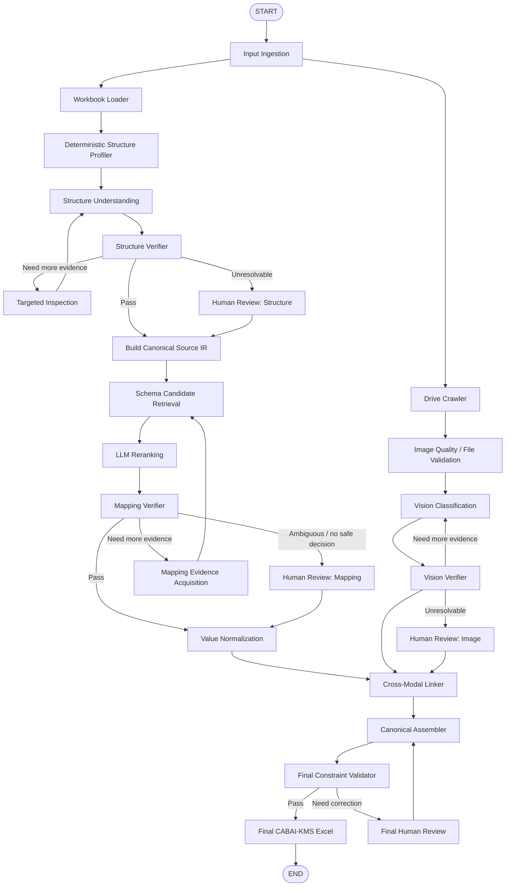
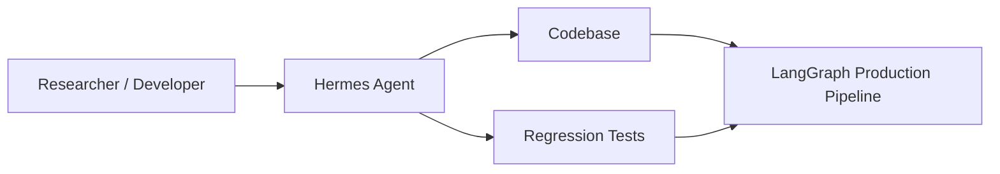
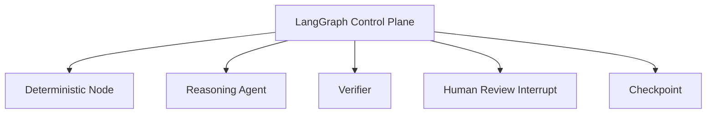

# Rekomendasi Arsitektur Agentic AI untuk Knowledge Acquisition Multimodal CABAI-KMS

**Dokumen desain dan rekomendasi teknis**  
**Basis utama:** Draft Proposal Tugas Akhir *“Knowledge Acquisition Berbasis LLM untuk Validasi Struktur dan Pemetaan Data Excel pada CABAI-KMS”*  
**Fokus:** preprocessing/knowledge acquisition multimodal dari spreadsheet Excel heterogen dan citra pada Google Drive  
**Status:** rekomendasi arsitektur setelah analisis LangGraph vs Hermes Agent dan evaluasi ulang desain agen  
**Tanggal:** 5 September 2026

---

## 0. Tujuan Dokumen

Dokumen ini merangkum secara terstruktur rekomendasi perbaikan terhadap rancangan sistem pada proposal Tugas Akhir, terutama untuk menjawab empat pertanyaan utama:

1. Apakah **LangGraph** masih merupakan pilihan yang tepat sebagai orkestrator utama?
2. Apakah **Hermes Agent** lebih baik digunakan sebagai pengganti LangGraph?
3. Apakah pembagian agen/modul pada rancangan awal sudah sesuai?
4. Bagaimana sistem dapat menangani **sebanyak mungkin variasi spreadsheet yang tidak terstruktur/berantakan** dengan risiko kesalahan seminimal mungkin?

Keputusan desain utama yang direkomendasikan adalah:

> **Pertahankan LangGraph sebagai orchestration/control plane utama. Jangan menggantinya dengan Hermes Agent untuk runtime inti penelitian. Tambahkan lapisan Spreadsheet Structure Understanding sebelum Schema Matching, gunakan pendekatan hybrid deterministic + probabilistic, jadikan provenance dan human review sebagai first-class mechanism, serta optimalkan selective automation: sistem hanya melakukan auto-accept ketika evidence cukup kuat dan melakukan abstention/escalation pada kasus ambigu.**

Target sistem sebaiknya **bukan “memaksa 100% kasus diproses otomatis”**, tetapi:

> **memaksimalkan automation coverage dengan mempertahankan auto-accept precision setinggi mungkin dan meminimalkan silent error.**

Dengan kata lain, sistem harus lebih memilih:

```text
"TIDAK YAKIN → REVIEW"
```

daripada:

```text
"TIDAK YAKIN → TETAP MENEBAK"
```

---

# 1. Ringkasan Sistem Penelitian

Penelitian berfokus pada **adaptive knowledge acquisition** untuk CABAI-KMS dengan dua sumber data multimodal:

1. **Spreadsheet Excel** dengan struktur dan terminologi yang heterogen.
2. **Citra spesimen cabai** yang disimpan di Google Drive atau cloud storage lain.

Target akhir adalah sebuah spreadsheet terstandardisasi berdasarkan **canonical schema CABAI-KMS** yang pada proposal terdiri atas:

- 55 baris karakteristik morfologis; dan
- 1 baris tambahan untuk path/metadata citra.

Sehingga total target adalah:

```text
R = {r1, r2, ..., r56}
```

Kolom merepresentasikan varietas atau aksesi:

```text
V = {v1, v2, ..., vn}
```

dan setiap sel kanonik:

```text
D : R × V → Value ∪ {NULL}
```

Prinsip penting yang dipertahankan:

- tidak semua sel harus terisi;
- nilai yang memang tidak tersedia harus menjadi `NULL`;
- sistem tidak boleh menghalusinasi nilai;
- keterhubungan citra dengan varietas harus dapat ditelusuri;
- keluaran akhir harus dapat diaudit sampai ke sumber asalnya.

---

# 2. Keputusan Utama: LangGraph vs Hermes Agent

## 2.1 Keduanya bukan produk dengan peran yang identik

LangGraph dan Hermes Agent sebaiknya tidak diperlakukan sebagai dua framework yang sepenuhnya substitutif.

### LangGraph

LangGraph lebih tepat diposisikan sebagai:

> **stateful orchestration runtime untuk workflow agentic yang eksplisit, durable, dapat di-checkpoint, dapat di-pause/resume, dan dapat menggabungkan node deterministic dengan node berbasis LLM.**

Karakteristik yang relevan untuk penelitian ini:

- shared graph state;
- node dan edge eksplisit;
- conditional routing;
- persistence/checkpointing;
- human-in-the-loop via interrupt/resume;
- recovery dari kegagalan;
- mudah melakukan tracing per node;
- sesuai untuk workflow yang urutannya didefinisikan oleh peneliti.

### Hermes Agent

Hermes Agent lebih tepat diposisikan sebagai:

> **general-purpose autonomous agent harness dengan tool use, persistent memory, skills, self-improvement, code execution, dan subagent delegation.**

Keunggulan Hermes berada pada:

- autonomous task execution;
- persistent memory;
- reusable skills;
- subagent delegation;
- code/tool execution;
- workflow yang lebih banyak diputuskan secara dinamis oleh agent.

Kekuatan tersebut sangat berguna untuk personal assistant, coding agent, research agent, atau task automation yang membutuhkan autonomy tinggi.

Namun, penelitian CABAI-KMS memiliki kebutuhan utama:

```text
reproducibility
+ traceability
+ deterministic checkpoints
+ explicit transitions
+ bounded retry
+ controlled human review
```

sehingga **LangGraph lebih sesuai sebagai runtime inti**.

---

## 2.2 Tabel perbandingan

| Dimensi | LangGraph | Hermes Agent | Kesesuaian untuk CABAI-KMS |
|---|---|---|---|
| Fokus | Orchestration runtime | Autonomous agent harness | LangGraph |
| Shared state eksplisit | Sangat kuat | Ada session/memory, tetapi bukan fokus graph-state | LangGraph |
| Node/edge eksplisit | Native | Tidak menjadi abstraksi utama | LangGraph |
| Conditional routing | Native | Dapat dicapai melalui reasoning/tool loop | LangGraph |
| Checkpoint workflow | Native | Memiliki persistence/session tetapi model kerja berbeda | LangGraph |
| Human-in-the-loop | Sangat kuat melalui interrupt/resume | Bisa melalui approval/gating | LangGraph |
| Fault recovery | Sangat sesuai untuk workflow | Ada mekanisme background/session | LangGraph |
| Autonomous planning | Bisa dibuat | Sangat kuat | Hermes |
| Persistent agent memory | Opsional | Fitur utama | Hermes |
| Reusable procedural skills | Bukan fokus utama | Fitur utama | Hermes |
| Subagent delegation | Bisa menggunakan subgraph/agent pattern | Sangat kuat | Hermes |
| Reproducibility eksperimen | Tinggi jika graph/prompt/model dibekukan | Harus membekukan memory/skills agar stabil | LangGraph |
| Auditability per step | Sangat kuat | Ada logs/session, tetapi autonomy lebih tinggi | LangGraph |
| ETL/knowledge acquisition terkontrol | Sangat cocok | Bisa, tetapi tidak ideal sebagai control plane | LangGraph |
| Cocok untuk penelitian ini | **★★★★★** | **★★★☆☆** | **LangGraph** |

---

## 2.3 Keputusan arsitektural

### Gunakan LangGraph untuk:

- control flow;
- shared state;
- branching;
- retry;
- verifier routing;
- checkpointing;
- human review;
- orchestration antar-modul.

### Hermes Agent dapat digunakan secara opsional sebagai:

- development assistant;
- research assistant;
- generator test case;
- analyzer terhadap failed cases;
- pembantu membuat regression test;
- pembantu menganalisis log eksperimen;
- pembantu membuat heuristik baru ketika ditemukan pola kegagalan.

### Jangan jadikan Hermes sebagai:

```text
Excel + Drive
    ↓
Hermes
    ↓
"bersihkan semuanya"
```

untuk runtime inti TA.

Alasannya adalah kontrol terhadap eksperimen menjadi lebih sulit apabila agent secara aktif:

- mengubah skill;
- menyimpan pengalaman;
- mengambil strategi baru berdasarkan memory;
- mendelegasikan pekerjaan secara dinamis tanpa state transition yang secara eksplisit menjadi bagian desain eksperimen.

Untuk eksperimen akademik, perilaku sistem perlu dapat direproduksi dengan kondisi:

```text
input yang sama
+ graph yang sama
+ prompt yang sama
+ model yang sama
+ konfigurasi yang sama
= eksperimen yang dapat diulang
```

---

# 3. Reframing: Sistem Ini Bukan “Semua Komponen adalah Agent”

Rancangan awal menggunakan istilah beberapa agen, tetapi secara engineering sebaiknya dibedakan antara:

## 3.1 Reasoning agents

Komponen yang memang membutuhkan reasoning probabilistik:

1. **Spreadsheet Structure Understanding Agent**
2. **Schema Matching/Reranking Agent**
3. **Vision & Classification Agent**
4. Opsional: **Cross-Modal Conflict Resolver** apabila konflik tidak dapat diselesaikan deterministic.

## 3.2 Deterministic modules

Komponen yang seharusnya dikerjakan dengan kode biasa:

1. Workbook Loader
2. Spreadsheet Structure Profiler
3. Drive Crawler
4. MIME/file validator
5. Attribute extractor setelah struktur diketahui
6. Value normalizer
7. Referential integrity checker
8. Canonical assembler
9. Final constraint validator
10. Provenance logger
11. Exporter

Istilah yang lebih defensible untuk proposal adalah:

> **Hybrid Agentic Workflow / Hybrid Multi-Component Agentic System**

dengan:

> **specialized reasoning agents + deterministic modules + explicit verifier nodes**.

Ini lebih kuat dibanding memaksa setiap komponen diberi label “agent”.

---

# 4. Masalah Terpenting yang Belum Cukup Eksplisit pada Proposal Awal

Rancangan awal kuat pada **Schema Matching**, tetapi masih mengasumsikan bahwa sistem telah mengetahui:

- mana header;
- mana data;
- orientasi tabel;
- parent header;
- baris/kolom mana yang merepresentasikan atribut.

Pada spreadsheet nyata, masalah sebelum semantic matching justru dapat berupa:

- header berada pada baris ke-4, bukan baris pertama;
- ada title di atas tabel;
- ada merged cells;
- header bertingkat 2–4 level;
- satu worksheet berisi beberapa tabel;
- terdapat repeated header di tengah tabel;
- ada baris kosong sebagai separator;
- ada catatan kaki;
- terdapat hidden rows/columns;
- unit berada pada baris terpisah;
- data dimulai setelah beberapa metadata eksperimen;
- orientation bersifat transposed;
- sebagian atribut berada di baris, sebagian di kolom;
- cell formatting membawa informasi hierarki.

Contoh:

```text
             DATA MORFOLOGI TANAMAN

             Karakter Vegetatif
------------------------------------------------
No | Varietas |     Tinggi       | Diameter
             | cm | kategori     | batang (mm)
------------------------------------------------
1  | Rawit A  | 85 | sedang      | 12
2  | Rawit B  | 92 | tinggi      | 14
```

Schema Matcher tidak boleh langsung menerima worksheet mentah.

Sistem terlebih dahulu harus menghasilkan struktur seperti:

```text
table_range     = A3:E7
header_depth    = 2
orientation     = row_oriented

attribute_1:
  header_path   = ["Karakter Vegetatif", "Tinggi", "cm"]
  values_range  = C5:C7

attribute_2:
  header_path   = ["Karakter Vegetatif", "Tinggi", "kategori"]
  values_range  = D5:D7

attribute_3:
  header_path   = ["Diameter", "batang (mm)"]
  values_range  = E5:E7
```

Karena itu direkomendasikan menambah:

> **Spreadsheet Structure Understanding Layer**

sebelum Schema Matching.

---

# 5. Arsitektur Rekomendasi

## 5.1 High-level architecture



---

# 6. Prinsip Desain Utama

## 6.1 Reliability before autonomy

Prioritas desain:

```text
Correctness
    >
Traceability
    >
Coverage
    >
Autonomy
```

Sistem tidak perlu terlihat “paling agentic” jika hasilnya menjadi lebih sulit dikontrol.

---

## 6.2 Deterministic when possible, probabilistic only when necessary

Gunakan kode biasa apabila masalah dapat diselesaikan secara presisi.

Contoh deterministic:

- membaca cell;
- traversal Drive;
- memeriksa MIME type;
- mengubah separator desimal;
- mengisi Excel output;
- memeriksa apakah file ID ada;
- validasi tipe data;
- memeriksa duplicate key.

Gunakan LLM/VLM ketika masalah membutuhkan semantic reasoning:

- apakah `"Plant hgt."` sama dengan `"Tinggi Tanaman"`?
- apakah `"Length"` merujuk ke panjang daun atau panjang buah berdasarkan konteks?
- apakah merged header merupakan hierarki data atau hanya judul dekoratif?
- apakah dua header yang tampak mirip sebenarnya memiliki fungsi berbeda?

---

## 6.3 Structure before semantics

Urutan yang benar:

```text
Raw Spreadsheet
      ↓
Understand structure
      ↓
Extract attributes
      ↓
Understand semantics
      ↓
Map to canonical schema
```

Bukan:

```text
Raw Spreadsheet
      ↓
LLM semantic matching
```

---

## 6.4 Preserve provenance

Setiap nilai final harus memiliki jalur balik menuju sumber.

Contoh provenance:

```yaml
canonical_row: r8
canonical_label: Tinggi Tanaman
final_value: "85 cm"

source:
  file: pengamatan_cabai.xlsx
  sheet: Sheet1
  cell: D17
  header_cells:
    - D3
    - D4
  raw_header: "Height"
  parent_header: "Vegetative Character"
  raw_value: "85"
  detected_unit: "cm"

mapping:
  method: retrieve_then_rerank
  candidates:
    - r8
    - r19
    - r22
  verifier_status: PASS
```

Provenance penting untuk:

- audit;
- debugging;
- evaluasi;
- human review;
- pembuktian saat sidang;
- reproduksi hasil;
- mengetahui sumber cascading error.

---

## 6.5 Abstention is a valid success state

`NULL`, `AMBIGUOUS`, dan `UNCERTAIN` tidak boleh selalu dianggap kegagalan.

Sistem harus memiliki kemampuan mengatakan:

```text
"Saya tidak memiliki evidence yang cukup untuk memutuskan secara aman."
```

Hal ini lebih baik daripada membuat keputusan salah.

---

# 7. Detail Komponen Sistem

# 7.1 Input Ingestion

Input minimum:

```text
source_workbook
drive_url
canonical_schema_version
pipeline_configuration
```

Opsional:

```text
user-provided hints
expected variety list
locale
known data source
```

Tahap ini hanya melakukan validasi awal:

- file bisa dibuka;
- extension valid;
- workbook tidak corrupt;
- Google Drive URL valid secara sintaksis;
- konfigurasi tersedia;
- canonical schema version ditemukan.

---

# 7.2 Workbook Loader

Gunakan `openpyxl` untuk mempertahankan informasi workbook yang tidak selalu tersedia secara penuh jika langsung diubah menjadi DataFrame.

Yang perlu dibaca:

- sheet names;
- used range;
- merged cell ranges;
- hidden rows;
- hidden columns;
- cell coordinates;
- raw values;
- formulas;
- number formats;
- font style;
- font bold/italic;
- fill;
- border;
- alignment;
- row height;
- column width;
- freeze panes;
- defined names jika relevan;
- comments jika memang ditemukan relevan.

Pandas tetap berguna **setelah** region data berhasil direlasionalisasi.

---

# 7.3 Deterministic Structure Profiler

Tujuan:

> membuat ringkasan struktural workbook sebelum LLM melihat konten.

Contoh output:

```json
{
  "sheet": "Karakterisasi",
  "used_range": "A1:N150",
  "merged_ranges": ["A1:N1", "C3:F3"],
  "hidden_rows": [],
  "hidden_columns": ["N"],
  "blank_row_segments": [[2, 2], [90, 92]],
  "candidate_regions": [
    {
      "range": "A3:M89",
      "density": 0.91,
      "candidate_header_rows": [3, 4],
      "candidate_orientation": "row_oriented"
    }
  ]
}
```

Profiling dapat memakai heuristik:

- cell density;
- perubahan data type antarbaris;
- bold/fill change;
- merged cell pattern;
- repeated textual patterns;
- empty separators;
- numeric density;
- uniqueness ratio;
- row/column entropy.

Hasil profiling **bukan keputusan final**, tetapi evidence untuk Structure Understanding.

---

# 7.4 Spreadsheet Structure Understanding Agent

Agent ini hanya dipanggil ketika struktur tidak dapat disimpulkan dengan aman secara deterministic atau ketika struktur kompleks.

Input:

1. structural sketch;
2. localized cell representation;
3. cell coordinates;
4. style/format summary;
5. optional screenshot/range image untuk region yang kompleks.

Agent harus menentukan:

```text
table regions
table orientation
header depth
header hierarchy
data region
attribute paths
identifier columns
candidate anchor fields
units
notes/footers
regions to ignore
```

Output harus structured, misalnya:

```yaml
sheet_name: Karakterisasi

tables:
  - table_id: t1
    range: A3:M89
    orientation: row_oriented

    header:
      rows: [3, 4]
      depth: 2

    identifier_columns:
      - A
      - B

    candidate_anchor:
      column: B
      label: Varietas

    attributes:
      - attribute_id: a1
        header_path:
          - Vegetative Character
          - Plant Height
        unit: cm
        value_range: C5:C89
        provenance:
          header_cells: [C3, C4]

    ignored_regions:
      - A1:M2
      - A90:M92
```

---

# 7.5 Structure Verifier

Verifier tidak sekadar memeriksa valid JSON.

Ia memeriksa:

### Structural constraints

- setiap detected table memiliki range valid;
- header dan data region tidak bertabrakan secara tidak masuk akal;
- setiap attribute memiliki source range;
- attribute range berada di dalam table range;
- orientation konsisten dengan axis yang dipilih;
- merged headers di-resolve secara konsisten;
- tidak ada cell data yang terduplikasi ke dua atribut kecuali justified;
- anchor field tidak sepenuhnya kosong.

### Confidence-independent evidence

Jangan hanya menggunakan:

```text
model_confidence >= threshold
```

Lebih baik gunakan evidence gabungan:

```text
structure consistency
+ cell pattern consistency
+ header/data type transition
+ formatting evidence
+ non-overlapping regions
+ verifier rules
```

---

# 7.6 Targeted Inspection / Evidence-Seeking Retry

Retry yang direkomendasikan bukan:

```text
LLM gagal
↓
"coba lagi"
```

tetapi:

```text
LLM/verifier menemukan sumber ketidakpastian
↓
sistem mencari evidence tambahan
↓
baru dilakukan reevaluation
```

Contoh:

### Kasus 1: header ambigu

```text
"Tinggi"
```

Evidence tambahan:

- parent merged header;
- nearby columns;
- unit;
- sample values.

### Kasus 2: table boundary ambigu

Evidence tambahan:

- inspect 10 rows sebelum/sesudah;
- check style break;
- check blank runs;
- check repeated header.

### Kasus 3: orientation ambigu

Evidence tambahan:

- uniqueness per row/column;
- text-to-numeric transition;
- known canonical term density.

### Kasus 4: mapping ambigu

Evidence tambahan:

- parent header;
- unit;
- more sample values;
- additional top-k candidates;
- sibling attributes.

Retry menjadi:

> **Evidence-Seeking Retry**

bukan sekadar re-prompt.

---

# 7.7 Canonical Source Intermediate Representation (Source IR)

Setelah struktur dipahami, jangan langsung masuk ke canonical schema CABAI-KMS.

Bangun **Source IR** sebagai representasi antara.

Contoh:

```yaml
source_file: pengamatan.xlsx
sheet: Data

table_id: t1
orientation: row_oriented

entity_axis:
  type: row
  anchor_attribute: a_variety

attributes:
  - id: a_variety
    raw_label: "Jenis Cabai"
    normalized_label: "jenis cabai"
    parent_headers: []
    detected_dtype: categorical
    unit: null
    cells: B5:B89

  - id: a_height
    raw_label: "Height"
    normalized_label: "height"
    parent_headers:
      - "Vegetative Character"
    detected_dtype: numeric
    unit: cm
    cells: C5:C89
    samples:
      - 85
      - 92
      - 74

provenance:
  extraction_version: "structure-v1"
```

Manfaat Source IR:

- memisahkan masalah structure parsing dari semantic mapping;
- memungkinkan debugging;
- memudahkan unit test;
- memungkinkan schema matcher menerima input yang konsisten;
- memungkinkan penggunaan berbagai jenis spreadsheet dengan downstream pipeline yang sama.

---

# 7.8 Drive Crawler Module

Tetap deterministic.

Tugas:

- akses folder via service account;
- BFS/DFS recursion;
- pagination;
- MIME validation;
- collect file IDs;
- file names;
- parent folder;
- relative path;
- file size;
- timestamps;
- access URL/ID.

Output:

```yaml
images:
  - file_id: ...
    file_name: IMG_001.jpg
    relative_path: Rawit_NTB/IMG_001.jpg
    mime_type: image/jpeg
    size: ...
```

Nama komponen disarankan:

> **Drive Crawler Module**

bukan “agent”, karena tidak membutuhkan semantic autonomy.

---

# 7.9 Image Quality Gate

Sebelum vision classification, lakukan validasi deterministic/low-cost:

- file dapat dibaca;
- image tidak corrupt;
- resolusi minimum;
- format supported;
- ukuran wajar;
- duplicate hash;
- optional blur score;
- optional brightness/exposure sanity check.

Tujuannya agar model vision tidak diminta mengambil keputusan pada input yang jelas tidak layak.

Output dapat berupa:

```text
VALID
LOW_QUALITY
CORRUPT
UNSUPPORTED
DUPLICATE
```

---

# 7.10 Vision & Classification Agent

Konsep awal `KNOWN / OTHER / UNCERTAIN` dipertahankan karena sesuai dengan open-world behavior.

Output:

```yaml
classification_status: KNOWN | OTHER | UNCERTAIN
known_variety: optional
proposed_new_variety: optional
raw_model_score: optional
visual_evidence_summary: string
quality_warning: optional
```

Catatan:

### Jangan menganggap self-reported confidence sebagai probabilitas kebenaran.

Jika model mengeluarkan:

```text
confidence = 0.95
```

nilai tersebut hanya menjadi salah satu feature, bukan satu-satunya acceptance gate.

---

# 7.11 Vision Verifier dan Cross-Modal Verification

Untuk pipeline produksi, identitas varietas sebaiknya tidak selalu ditentukan dari image saja.

Evidence dapat berasal dari:

```text
image appearance
+
folder name
+
file name
+
spreadsheet variety/anchor
+
existing CABAI variety vocabulary
```

Contoh:

```text
Spreadsheet anchor : Cabai Rawit NTB
Folder              : /Rawit_NTB/
Image model         : Rawit NTB

→ strong agreement
```

Contoh konflik:

```text
Spreadsheet anchor : Rawit NTB
Folder              : Rawit_NTB
Vision              : large red chili / different morphology

→ CONFLICT
→ REVIEW
```

### Sangat penting untuk evaluasi ilmiah

Bedakan dua mode:

#### Mode A — isolated vision experiment

Input:

```text
IMAGE ONLY
```

Digunakan untuk menilai kemampuan visual classifier.

#### Mode B — production cross-modal verification

Input:

```text
IMAGE
+ FILE/FOLDER METADATA
+ TABULAR CONTEXT
```

Digunakan untuk meningkatkan reliability end-to-end.

Jangan memberikan label dari filename/folder pada eksperimen image-only karena dapat menyebabkan **data leakage**.

---

# 7.12 Schema Candidate Retrieval

Pendekatan **retrieve-then-rerank** tetap direkomendasikan.

Namun ada satu perubahan penting:

## Untuk canonical schema yang hanya berisi 56 rows, ANN tidak diperlukan.

Proposal awal menggunakan Approximate Nearest Neighbor (ANN).

Untuk hanya 56 canonical records:

```text
56 cosine similarities
```

sangat murah.

Gunakan **exact cosine similarity / exact k-nearest retrieval**.

Keuntungan:

- tidak ada approximation error;
- lebih mudah direproduksi;
- lebih mudah diuji;
- lebih mudah dijelaskan;
- tidak membutuhkan vector database yang kompleks.

Pseudo-flow:

```text
canonical embeddings: 56 vectors
source query embedding: 1 vector
↓
compute cosine against all 56
↓
sort exact
↓
take top-k
```

Jika suatu hari canonical schema berkembang menjadi ribuan/puluhan ribu konsep, baru pertimbangkan:

- FAISS;
- Qdrant;
- Milvus;
- vector database lain.

Untuk skala TA sekarang, **exact retrieval adalah best practice yang lebih selaras dengan target akurasi**.

---

# 7.13 Representasi Canonical Schema

Pertahankan konsep rich representation:

```text
label
+ domain
+ example values
+ alternative labels
```

Dapat diperluas menjadi:

```text
canonical label
domain
definition
unit expectation
datatype expectation
allowed/typical values
examples
altLabels/synonyms
exclusion hints
```

Contoh:

```yaml
id: r8
label: "Tinggi Tanaman"
domain: "vegetatif"
datatype: numeric
unit: cm

examples:
  - "60-89 cm"
  - "100 cm"

alt_labels:
  - plant height
  - height
  - tinggi
  - TT

negative_hints:
  - fruit length
  - leaf length
```

`negative_hints` opsional dan harus dibangun hati-hati dari expert knowledge, bukan dikarang otomatis.

---

# 7.14 Source Attribute Semantic Profile

Query jangan hanya berisi header.

Gunakan:

```text
raw label
+ parent headers
+ sibling context
+ sample values
+ detected datatype
+ detected unit
+ table orientation
+ optional source description
```

Contoh:

```yaml
raw_label: Height
parent_headers:
  - Vegetative Character
samples:
  - 85
  - 92
  - 74
datatype: numeric
unit: cm
```

Ini jauh lebih kuat dibanding:

```text
"Height"
```

saja.

---

# 7.15 LLM Reranker

LLM hanya melihat:

1. source semantic profile;
2. top-k candidate dari exact retrieval;
3. metadata candidate;
4. output contract.

### Jangan meminta hidden chain-of-thought sebagai artifact sistem.

Untuk audit, gunakan:

```text
decision
reason_code
evidence_summary
conflicts
```

bukan menyimpan chain-of-thought panjang.

Contoh:

```yaml
mapping_type: ONE_TO_ONE
targets:
  - r8

reason_code:
  - SEMANTIC_LABEL_MATCH
  - DOMAIN_MATCH
  - UNIT_MATCH
  - VALUE_PATTERN_COMPATIBLE

evidence_summary:
  "Header 'Height' berada di bawah Vegetative Character,
   bertipe numerik dan unit cm."

conflicts: []
```

---

# 7.16 Contract Mapping Harus Mendukung Lebih dari One-to-One

Rancangan awal:

```text
source attribute → r1 ... r56 | NULL
```

terlalu terbatas.

Gunakan:

```text
mapping_type:
- ONE_TO_ONE
- ONE_TO_MANY
- NO_MATCH
- AMBIGUOUS
```

Output:

```yaml
source_attribute_id: a17
mapping_type: ONE_TO_MANY
targets:
  - r8
  - r9
normalization_required: true
```

Contoh:

```text
"Tinggi dan Lebar Tanaman"
```

dapat memiliki dua target.

Namun pemetaan `ONE_TO_MANY` hanya boleh diterima apabila nilai juga dapat didekomposisi dengan aman.

Contoh aman:

```text
raw value = "85 x 40 cm"
```

dengan format yang jelas.

Contoh tidak aman:

```text
raw value = "besar"
```

→ `AMBIGUOUS` atau review.

---

# 7.17 Mapping Verifier

Jangan hanya percaya keputusan LLM.

Gabungkan evidence:

```text
semantic agreement
+ retrieval score
+ top1-vs-top2 margin
+ domain compatibility
+ datatype compatibility
+ unit compatibility
+ value pattern compatibility
+ structural context
```

Contoh high-confidence mapping:

```text
Source:
Plant Height

Parent:
Vegetative Character

Values:
82, 90, 95

Unit:
cm

Target:
Tinggi Tanaman

Checks:
semantic        PASS
domain          PASS
datatype        PASS
unit            PASS
value pattern   PASS
retrieval       PASS

→ AUTO_ACCEPT
```

Contoh ambiguous:

```text
Source:
Length

Values:
10, 11, 8

No parent context
No unit

Candidates:
Panjang Daun
Panjang Buah
Panjang Tangkai

→ REVIEW
```

---

# 7.18 Value Normalizer

Setelah mapping disetujui, baru nilai dinormalisasi.

Urutan:

```text
mapping decision
↓
target canonical constraints known
↓
value normalization
```

Jenis normalisasi:

### Range

```text
60–89 cm
```

dapat dipertahankan atau direpresentasikan:

```yaml
min: 60
max: 89
unit: cm
```

### Decimal locale

```text
8,7
```

↔

```text
8.7
```

sesuai standar downstream.

### Multi-value

```text
green group 137 B; green group 137 A
```

dipertahankan bila canonical schema menggunakan konvensi yang sama.

### Typographical normalization

```text
grreen group 137 A
```

dapat menjadi:

```text
green group 137 A
```

**hanya jika correction bersifat unambiguous**.

Jika terdapat lebih dari satu kandidat istilah:

```text
→ REVIEW
```

### Unit normalization

Contoh:

```text
0.85 m
```

dapat menjadi:

```text
85 cm
```

jika canonical field mengharuskan cm dan konversi jelas.

Semua transformasi harus masuk provenance log.

---

# 7.19 Cross-Modal Linker

Menghubungkan:

```text
canonical variety
↔
image metadata
↔
vision/cross-modal result
```

Bukan hanya berdasarkan predicted class.

Gunakan evidence hierarchy:

1. explicit spreadsheet-image identifier;
2. exact file reference pada spreadsheet;
3. folder/filename metadata;
4. anchor variety;
5. vision classification;
6. manual review bila konflik.

Semakin eksplisit link-nya, semakin sedikit ketergantungan pada prediction.

---

# 7.20 Canonical Assembler

Tugas deterministic:

- membuat/memilih kolom varietas;
- mengisi 55 morphological rows;
- mengisi row path citra;
- menulis explicit NULL;
- menggabungkan multi-image;
- menjaga format template;
- menjaga provenance map terpisah.

Canonical assembler **tidak boleh menebak**.

Ia hanya mengeksekusi mapping yang sudah disetujui.

---

# 7.21 Final Constraint Validator

Sebelum export:

### Schema constraints

- tepat 56 canonical rows;
- row IDs tidak berubah;
- canonical labels sesuai version;
- tidak ada unknown row;
- setiap varietas memiliki identifier;
- path citra hanya berisi referensi valid.

### Data constraints

- numeric field tidak berisi arbitrary text kecuali format canonical mengizinkan;
- unit konsisten;
- allowed categorical values diperiksa bila dictionary tersedia;
- duplicates terdeteksi;
- mandatory metadata tersedia bila memang mandatory.

### Referential constraints

- image reference ditemukan di Drive crawl result;
- tidak ada path yang menunjuk file yang tidak ada;
- duplicate image link ditandai bila tidak diharapkan.

### Provenance constraints

- setiap non-NULL cell memiliki source provenance;
- setiap transformasi memiliki normalization trace;
- setiap auto-accepted mapping memiliki verifier result.

---

# 8. Desain State LangGraph

Contoh conceptual state:

```python
class PipelineState(TypedDict):
    run_id: str

    # Input
    source_workbook_path: str
    drive_url: str
    canonical_schema_version: str

    # Workbook
    workbook_profile: dict
    structure_hypothesis: dict
    verified_structure: dict
    source_ir: dict

    # Images
    drive_files: list
    image_quality_results: list
    vision_results: list
    cross_modal_results: list

    # Schema matching
    retrieval_results: list
    mapping_results: list
    verified_mappings: list

    # Normalization
    normalized_values: list

    # Output
    canonical_data: dict
    output_file_path: str

    # Reliability
    error_trace: list
    review_queue: list
    retry_count: dict
    provenance_log: list

    # Evaluation/debug
    node_metrics: dict
```

Prinsip:

> Simpan **raw structured data**, bukan hanya formatted prompt text.

Prompt dapat selalu dibuat ulang dari state.

---

# 9. Retry Policy yang Direkomendasikan

Maksimum retry tetap dibatasi, tetapi retry harus kategorikal.

Contoh:

```yaml
retry_policy:
  structure_understanding:
    max_retry: 2
    strategy:
      - inspect_larger_range
      - include_style_summary

  schema_mapping:
    max_retry: 2
    strategy:
      - increase_top_k
      - add_more_sample_values
      - inspect_parent_header

  vision:
    max_retry: 1
    strategy:
      - reprocess_high_resolution
```

Jika evidence baru tidak tersedia:

```text
DO NOT RETRY
→ ESCALATE
```

---

# 10. Error Trace

Error trace harus terstruktur.

Contoh:

```yaml
error_id: E-MAP-017
node: mapping_verifier
category: AMBIGUOUS_TARGET
source_attribute_id: a27

previous_output:
  selected_target: r20

evidence:
  top_candidates:
    - r20
    - r31
  score_margin: 0.01
  unit: null
  parent_context: null

corrective_action:
  type: ACQUIRE_MORE_CONTEXT
  requested:
    - sibling_headers
    - additional_values
```

Kategori error dapat meliputi:

### Structural

- TABLE_BOUNDARY_AMBIGUOUS
- HEADER_DEPTH_AMBIGUOUS
- ORIENTATION_AMBIGUOUS
- MULTI_TABLE_CONFLICT
- MERGED_HEADER_UNRESOLVED

### Mapping

- LOW_RETRIEVAL_SEPARATION
- DOMAIN_CONFLICT
- UNIT_CONFLICT
- TYPE_CONFLICT
- COMPOSITE_ATTRIBUTE
- NO_CANONICAL_MATCH
- MULTIPLE_VALID_TARGETS

### Vision

- LOW_IMAGE_QUALITY
- MODEL_DISAGREEMENT
- METADATA_VISION_CONFLICT
- UNKNOWN_VARIETY
- INSUFFICIENT_VISUAL_EVIDENCE

---

# 11. Human-in-the-Loop sebagai First-Class Workflow

Human review bukan fallback “karena sistem gagal”.

Human review adalah bagian desain reliability.

Review item harus berisi:

```text
source context
candidate decisions
evidence
reason for escalation
suggested action
```

Contoh UI:

```text
Source attribute:
"Length"

Parent header:
<none>

Sample values:
10, 12, 8

Top candidates:
1. Panjang Daun
2. Panjang Buah
3. Panjang Tangkai

Reason:
Insufficient structural and unit evidence

Actions:
[Choose Panjang Daun]
[Choose Panjang Buah]
[Choose Panjang Tangkai]
[No Match]
```

Setelah reviewer memilih, keputusan tersebut masuk provenance.

Untuk **eksperimen utama**, hasil human review jangan dicampur ke automated accuracy. Laporkan secara terpisah.

---

# 12. Definisi Target “100% Benar”

## 12.1 Mengapa 100% full automation tidak realistis

Contoh input:

```text
Header: Length
Value: 12.5
```

Tanpa:

- parent header;
- unit;
- domain;
- sibling attributes;
- metadata lain.

Tidak ada evidence yang cukup untuk menentukan:

- panjang daun;
- panjang buah;
- panjang tangkai;
- panjang bagian lain.

Kesalahan bukan hanya akibat model lemah.

Masalahnya adalah **informasi pembeda tidak ada di input**.

Karena itu target yang sehat:

> **100% automated coverage tidak boleh menjadi keharusan.**

---

# 13. Selective Automation sebagai Objektif Utama

Sistem menghasilkan tiga kelas keputusan:

```text
AUTO_ACCEPT
REVIEW
NO_MATCH / NULL
```

Tujuan:

```text
maximize automation coverage
subject to error risk <= epsilon
```

atau secara konseptual:

```text
maximize Coverage
s.t. AutoAcceptPrecision ≥ target
```

---

# 14. Metrik Utama yang Direkomendasikan

# 14.1 Auto-Accept Precision

```text
Auto-Accept Precision
=
jumlah keputusan AUTO_ACCEPT yang benar
/
jumlah seluruh keputusan AUTO_ACCEPT
```

Ini metrik yang paling relevan terhadap tujuan “sebisa mungkin jangan salah”.

Contoh:

```text
327 auto-accepted
327 correct

Auto-Accept Precision = 100%
```

Tetapi jangan menulis bahwa ini membuktikan true population accuracy = 100%.

Laporkan juga confidence interval statistik.

Dengan zero observed error, ukuran test set tetap membatasi keyakinan terhadap error rate populasi.

---

# 14.2 Automation Coverage

```text
Automation Coverage
=
jumlah kasus AUTO_ACCEPT
/
jumlah seluruh kasus yang seharusnya diputuskan
```

Contoh:

```text
327 auto-accept
400 total

coverage = 81.75%
```

Interpretasi:

> Sistem dapat menyelesaikan 81.75% kasus secara otomatis pada operating point yang dipilih.

---

# 14.3 Manual Review Rate

```text
Manual Review Rate
=
jumlah review
/
total kasus
```

Metrik ini penting untuk menilai beban manusia.

---

# 14.4 Abstention Correctness

Untuk kasus yang di-escalate:

```text
Abstention Precision
=
jumlah abstention yang memang ambigu/tidak aman
/
jumlah seluruh abstention
```

Sistem yang terlalu konservatif dapat memiliki precision tinggi tetapi coverage sangat rendah.

Karena itu precision harus selalu dibaca bersama coverage.

---

# 14.5 Silent Error Rate

Metrik sangat penting:

```text
Silent Error Rate
=
jumlah keputusan salah yang tidak ditandai sebagai uncertain/review
/
jumlah seluruh output otomatis
```

Target:

```text
sedekat mungkin dengan 0
```

Untuk knowledge acquisition, silent error lebih berbahaya daripada abstention.

---

# 14.6 Risk-Coverage Curve

Lakukan threshold sweep terhadap acceptance gate.

Untuk setiap threshold:

- hitung coverage;
- hitung error risk;
- hitung precision.

Hasil dapat divisualisasikan:

```text
threshold tinggi
→ sedikit auto-accept
→ precision tinggi

threshold rendah
→ banyak auto-accept
→ risiko meningkat
```

Pilih operating point berdasarkan tujuan CABAI-KMS.

---

# 15. Metrik Structure Understanding

Karena Structure Understanding ditambahkan sebagai komponen baru, ia harus dievaluasi.

## 15.1 Table Detection Accuracy

Apakah system mendeteksi region tabel yang benar?

Dapat menggunakan:

- exact range match;
- cell-level IoU.

```text
IoU =
|predicted_cells ∩ ground_truth_cells|
/
|predicted_cells ∪ ground_truth_cells|
```

---

## 15.2 Header Detection F1

Cell header ground truth vs predicted header cells.

- Precision
- Recall
- F1

---

## 15.3 Orientation Accuracy

```text
row-oriented
transposed
mixed/other
```

Accuracy pada klasifikasi orientation.

---

## 15.4 Attribute Extraction Accuracy

Apakah atribut yang diekstrak memiliki:

- header path benar;
- value range benar;
- unit benar;
- parent context benar.

Dapat dilaporkan:

```text
Exact Attribute Extraction Accuracy
```

---

## 15.5 Provenance Accuracy

```text
jumlah output yang menunjuk source cell yang benar
/
total output
```

Ini metrik tambahan yang sangat relevan terhadap auditability.

---

# 16. Metrik Schema Matching

Pertahankan:

- Precision
- Recall
- F1
- Hit-Rate@k

Tetapi definisinya perlu menyesuaikan support untuk:

```text
ONE_TO_ONE
ONE_TO_MANY
NO_MATCH
AMBIGUOUS
```

## 16.1 Pair-Level Precision/Recall/F1

Ground truth diperlakukan sebagai himpunan correspondence pairs:

```text
(source_attribute, canonical_target)
```

Cocok untuk one-to-many.

---

## 16.2 Exact Attribute Mapping Accuracy

Satu source attribute dianggap benar hanya jika **seluruh target set** sama dengan ground truth.

Contoh:

Ground truth:

```text
{r8, r9}
```

Prediksi:

```text
{r8}
```

maka exact attribute mapping = salah.

---

## 16.3 Hit-Rate@k

Tetap gunakan untuk retrieval.

Namun retrieval sebaiknya exact cosine untuk 56 schema rows.

Uji:

```text
k = 1
k = 3
k = 5
k = 10
```

Karena target hanya 56, `k=5` bisa menjadi pilihan default, tetapi sebaiknya ditentukan lewat eksperimen.

---

## 16.4 Candidate Margin

Catat:

```text
top1_similarity - top2_similarity
```

Margin dapat menjadi salah satu evidence verifier, tetapi **tidak otomatis berarti benar**.

---

# 17. Metrik Vision

Pertahankan:

- Top-1 accuracy untuk known classes;
- macro F1;
- per-class accuracy.

Tambahkan:

## 17.1 KNOWN Detection Accuracy

Kemampuan menentukan known variety dengan tepat.

## 17.2 OTHER Detection F1

Kemampuan mendeteksi bahwa image berada di luar known vocabulary.

## 17.3 UNCERTAIN Detection F1

Kemampuan abstain pada image yang memang ambigu/tidak layak.

## 17.4 Selective Vision Accuracy

Accuracy hanya pada image yang diterima otomatis.

## 17.5 Vision Coverage

Berapa proporsi image yang dapat diklasifikasikan tanpa review.

---

# 18. End-to-End Metrics

Komponen-level accuracy saja tidak cukup.

Gunakan:

## 18.1 End-to-End Success Rate

Pipeline sampai final state tanpa fatal error.

Tetapi metrik ini **tidak sama dengan data correctness**.

Pipeline dapat technically sukses tetapi menghasilkan mapping salah.

---

## 18.2 End-to-End Canonical Cell Accuracy

Bandingkan setiap canonical cell yang dihasilkan dengan ground truth.

```text
Cell Accuracy
=
correct canonical cells
/
evaluated canonical cells
```

---

## 18.3 End-to-End Exact Record Accuracy

Satu varietas dianggap correct hanya jika seluruh field yang seharusnya terisi sesuai ground truth.

Ini sangat ketat tetapi informatif.

---

## 18.4 Cascade Error Attribution

Untuk setiap final error, identifikasi root cause:

```text
structure
schema retrieval
reranker
normalization
vision
cross-modal linking
assembly
```

Laporkan distribusi akar masalah.

---

# 19. Desain Ground Truth yang Disarankan

Proposal awal telah mengusulkan anotasi oleh dua anotator.

Pertahankan dan perluas.

Ground truth sebaiknya mencakup:

```text
A. Structure Ground Truth
B. Schema Mapping Ground Truth
C. Normalized Value Ground Truth
D. Image Classification Ground Truth
E. Cross-Modal Link Ground Truth
F. Final Canonical Spreadsheet Ground Truth
```

Contoh structure ground truth:

```yaml
sheet: Data
table_range: A3:M90
orientation: row_oriented
header_rows: [3,4]
anchor_column: B

attributes:
  - source_id: a1
    header_cells: [C3, C4]
    header_path:
      - Vegetative Character
      - Plant Height
    values_range: C5:C90
```

Dengan ground truth seperti ini, kesalahan structure tidak tercampur dengan kesalahan semantic mapping.

---

# 20. Dataset Variation Matrix

Jangan hanya mengatakan “6 spreadsheet heterogen”.

Dokumentasikan dimensi heterogenitas setiap file.

Contoh:

| File | Orientation | Header Depth | Merged Cells | Multi-table | Language | Units | Empty Data | Messiness |
|---|---|---:|---:|---:|---|---|---:|---|
| F1 | Transposed | 1 | No | No | ID | Mixed | Low | Low |
| F2 | Transposed | 2 | Yes | No | EN | Explicit | Medium | Medium |
| F3 | Transposed | 3 | Yes | Yes | ID/EN | Mixed | High | High |
| F4 | Row-oriented | 2 | Yes | No | ID | Explicit | Medium | Medium |
| F5 | Row-oriented | 3 | Yes | Yes | EN | Mixed | High | High |
| F6 | Row-oriented | 2 | No | Yes | ID/Latin | Partial | High | High |

Jika tersedia lebih banyak data, tambah variasi:

- hidden row;
- notes;
- repeated header;
- formula;
- multiple worksheets;
- inconsistent unit;
- typo;
- duplicate column;
- blank header;
- arbitrary title;
- mixed decimal locale.

Tujuan bukan sekadar banyak file, tetapi **coverage terhadap jenis heterogenitas**.

---

# 21. Stress-Test Dataset

Selain real-world files, buat controlled perturbation copies untuk stress test.

Contoh perturbasi:

1. rename header;
2. add synonym;
3. introduce typo;
4. move header down;
5. add merged parent header;
6. transpose table;
7. add empty rows;
8. reorder columns;
9. convert decimal comma/dot;
10. add irrelevant column;
11. add notes above/below;
12. duplicate header;
13. hide a column;
14. introduce multi-value cells;
15. combine two attributes.

Penting:

> Synthetic perturbation digunakan sebagai stress test, **bukan pengganti real-world evaluation**.

---

# 22. Baseline Experiments

## 22.1 Schema Matching baseline

Pertahankan:

1. lexical/string similarity;
2. embedding-only;
3. LLM-only;
4. retrieve-then-rerank.

Tambahkan bila feasible:

5. retrieve-then-rerank + deterministic verifier;
6. retrieve-then-rerank + verifier + selective abstention.

Ini akan menunjukkan kontribusi verifier dan abstention, bukan hanya LLM reranking.

---

# 23. Ablation Study yang Disarankan

## 23.1 Canonical representation

A:

```text
label
```

B:

```text
label + domain
```

C:

```text
label + domain + examples
```

D:

```text
label + domain + examples + altLabels
```

E opsional:

```text
label + domain + examples + altLabels + datatype/unit constraints
```

---

## 23.2 Source semantic profile

Uji:

A:

```text
header only
```

B:

```text
header + parent header
```

C:

```text
header + parent + sample values
```

D:

```text
header + parent + samples + datatype + unit
```

Ini sangat berguna untuk membuktikan bahwa struktur spreadsheet memang membantu semantic matching.

---

## 23.3 Structure-aware vs flat-text

Bandingkan:

```text
flattened plain-text input
```

vs:

```text
structure-aware Source IR
```

Metrik:

- mapping F1;
- review rate;
- silent error;
- token usage.

Ini dapat menjadi eksperimen yang sangat kuat karena langsung menunjukkan kontribusi arsitektur baru.

---

## 23.4 Verifier ablation

Bandingkan:

```text
LLM decision only
```

vs:

```text
LLM + confidence threshold
```

vs:

```text
LLM + multi-evidence verifier
```

vs:

```text
LLM + multi-evidence verifier + abstention
```

---

# 24. Statistical Reporting untuk Klaim “100%”

Jika test set menunjukkan:

```text
327/327 auto-accepted decisions correct
```

laporkan:

```text
Observed Auto-Accept Precision = 100%
```

Tetapi jangan menulis:

```text
"Sistem dijamin 100% akurat."
```

Karena sampel terbatas tidak membuktikan population error = 0.

Gunakan confidence interval binomial/Wilson.

Juga dapat menggunakan intuisi **rule of three**:

Jika zero error diamati pada `n` sampel, upper 95% bound untuk failure probability kira-kira:

```text
3 / n
```

Misalnya:

```text
n = 327
upper failure bound ≈ 0.00917
```

atau sekitar 0.92%.

Artinya observed 100% tetap harus dipresentasikan dengan ukuran sampel dan interval keyakinan.

Ini jauh lebih kuat secara ilmiah.

---

# 25. Revised Research Objective

Daripada:

> membangun sistem yang dapat memperbaiki seluruh spreadsheet heterogen secara otomatis dengan akurasi 100%.

Gunakan framing seperti:

> **Merancang dan mengevaluasi pipeline adaptive knowledge acquisition multimodal yang mampu memahami struktur spreadsheet heterogen, memetakan atribut sumber ke skema kanonik CABAI-KMS, mengintegrasikan metadata/citra spesimen, serta menerapkan selective automation sehingga hanya keputusan yang tervalidasi yang diterima otomatis sementara kasus ambigu di-abstain atau dieskalasi untuk human review.**

---

# 26. Kandidat Rumusan Masalah Baru

1. **Bagaimana merancang mekanisme structure-aware extraction yang mampu mengidentifikasi region tabel, hierarki header, orientasi, atribut, dan provenance pada spreadsheet CABAI-KMS dengan variasi format yang heterogen?**

2. **Bagaimana pendekatan retrieve-then-rerank yang diperkaya structural context, sample values, datatype, unit, dan canonical metadata meningkatkan ketepatan schema matching dibandingkan baseline lexical, embedding-only, dan LLM-only?**

3. **Bagaimana mekanisme multi-evidence verification dan selective abstention memengaruhi trade-off antara automation coverage dan mapping error?**

4. **Bagaimana hasil klasifikasi visual dan metadata cloud dapat diintegrasikan secara cross-modal untuk menghubungkan citra spesimen dengan data tabular secara lebih reliabel?**

5. **Bagaimana performa keseluruhan pipeline pada component-level dan end-to-end, termasuk struktur, schema mapping, vision classification, cascade error, automation coverage, dan silent error?**

Tidak semua rumusan harus dipakai. Pilih 3–4 agar scope TA tetap realistis.

---

# 27. Kandidat Hipotesis Baru

### H1 — Structure-aware representation

> Penggunaan structure-aware Source IR yang mencakup header hierarchy, sample values, datatype, unit, dan provenance akan meningkatkan kualitas schema matching dibandingkan representasi header flat.

### H2 — Retrieve-then-rerank

> Retrieve-then-rerank menghasilkan mapping F1 lebih tinggi daripada lexical-only, embedding-only, dan LLM-only pada spreadsheet heterogen.

### H3 — Multi-evidence verifier

> Multi-evidence verification dengan abstention dapat menurunkan silent error dan meningkatkan auto-accept precision dengan trade-off berupa penurunan automation coverage.

### H4 — Cross-modal verification

> Penggabungan visual evidence dengan tabular/file metadata dapat meningkatkan reliability linking citra dibandingkan penggunaan vision classification secara tunggal dalam pipeline produksi.

---

# 28. Definisi Success Criteria

Sebelum eksperimen, tetapkan success criteria.

Contoh:

### Structure

```text
Header F1 ≥ target empiris
Orientation Accuracy ≥ target empiris
```

Jangan menetapkan angka terlalu tinggi tanpa pilot study.

### Mapping

Primary:

```text
F1 retrieve-then-rerank > baseline
```

Reliability:

```text
Auto-Accept Precision setinggi mungkin
Silent Error Rate serendah mungkin
```

Efficiency:

```text
Human Review Rate masih operasional
```

### End-to-end

```text
E2E cell correctness
+
success rate
+
cascade error distribution
```

---

# 29. Mengapa Precision 100% dan Coverage 100% Tidak Boleh Dipaksakan Bersamaan

Ada fundamental trade-off:

```text
strict acceptance
→ precision naik
→ coverage turun

loose acceptance
→ coverage naik
→ precision dapat turun
```

Karena itu sistem harus memilih operating threshold.

Contoh hipotetis:

| Threshold | Coverage | Auto-Accept Precision |
|---:|---:|---:|
| 0.50 | 96% | 91% |
| 0.60 | 91% | 95% |
| 0.70 | 84% | 98% |
| 0.80 | 72% | 99.5% |
| 0.90 | 55% | 100% observed |

Tabel di atas **contoh konseptual**, bukan hasil penelitian.

Nilai aktual harus berasal dari eksperimen.

---

# 30. Operasionalisasi Acceptance Gate

Jangan langsung menghitung rata-rata sederhana dari semua skor.

Gunakan kombinasi:

### Hard constraints

Jika gagal → tidak boleh auto-accept.

Contoh:

```text
unit incompatible
datatype incompatible
invalid target
missing source provenance
```

### Soft evidence

Digunakan untuk scoring:

- embedding similarity;
- reranker score/rank;
- margin;
- domain compatibility;
- value compatibility.

Contoh logic:

```text
IF target_valid
AND provenance_valid
AND datatype_compatible
AND unit_compatible
AND reranker_agrees
AND retrieval_margin >= threshold
THEN AUTO_ACCEPT
ELSE REVIEW
```

Acceptance rule harus dikalibrasi pada validation set.

---

# 31. Hindari Over-Reliance pada LLM Self-Reported Confidence

Masalah:

```text
LLM says confidence = 0.92
```

tidak otomatis berarti probabilitas benar 92%.

Gunakan confidence hanya sebagai:

```text
auxiliary signal
```

Bukan:

```text
ground truth probability
```

Lakukan threshold tuning berdasarkan validation dataset.

Jika memungkinkan, analisis:

- reliability curve;
- expected calibration error;
- acceptance precision by confidence bin.

---

# 32. Penanganan NULL yang Direkomendasikan

Bedakan minimal tiga konsep:

## MISSING_SOURCE_VALUE

Canonical field memiliki target, tetapi sumber kosong.

```text
canonical cell = NULL
reason = SOURCE_VALUE_MISSING
```

## NO_SCHEMA_MATCH

Source attribute memang tidak memiliki padanan canonical.

```text
mapping_type = NO_MATCH
```

## AMBIGUOUS_MAPPING

Padanan mungkin ada, tetapi evidence tidak cukup.

```text
mapping_type = AMBIGUOUS
→ review
```

Jangan menggunakan satu string `NULL` untuk seluruh kondisi karena maknanya berbeda.

---

# 33. Penanganan UNCERTAIN pada Vision

Bedakan:

```text
UNCERTAIN_LOW_QUALITY
UNCERTAIN_VISUAL_AMBIGUITY
UNCERTAIN_MODEL_DISAGREEMENT
UNCERTAIN_METADATA_CONFLICT
```

Hal ini membuat analysis error jauh lebih informatif.

---

# 34. Taxonomy Error yang Diperluas

## Spreadsheet structure

1. wrong table boundary;
2. wrong header depth;
3. wrong orientation;
4. parent-header loss;
5. multiple-table merge;
6. data row misclassified as header;
7. decorative title misclassified as header.

## Schema mapping

1. terminology mismatch;
2. composite attribute;
3. no canonical match forced into target;
4. botanical-domain ambiguity;
5. unit conflict;
6. datatype conflict;
7. sibling-context confusion;
8. retrieval miss;
9. reranker error.

## Value normalization

1. decimal parsing error;
2. range parsing error;
3. incorrect unit conversion;
4. over-aggressive typo correction;
5. multi-value splitting error.

## Vision

1. class confusion;
2. out-of-distribution mistaken as known;
3. known mistaken as other;
4. ambiguous image not abstained;
5. low-quality image accepted;
6. metadata-image conflict ignored.

## Cross-modal

1. wrong image-to-variety link;
2. duplicate image association;
3. missing image;
4. filename leakage;
5. folder identity inconsistency.

---

# 35. Skenario Pengujian Revisi

## Scenario 0 — Structure Understanding

Bandingkan:

```text
heuristic-only
vs
heuristic + structure reasoning
```

Metrik:

- table IoU;
- header F1;
- orientation accuracy;
- attribute extraction accuracy.

---

## Scenario 1A — Schema Matching Baselines

1. String similarity
2. Embedding-only
3. LLM-only
4. Retrieve-then-rerank
5. Retrieve-then-rerank + verifier
6. Retrieve-then-rerank + verifier + selective abstention

---

## Scenario 1B — Canonical Representation Ablation

- label
- label + domain
- + examples
- + altLabels
- + datatype/unit constraints

---

## Scenario 1C — Source Context Ablation

- header
- + parent header
- + sample values
- + datatype/unit
- + sibling context

---

## Scenario 2A — Vision Isolated

- model A image-only
- model B image-only
- optional consensus

Tidak boleh menggunakan filename/folder yang mengandung label.

---

## Scenario 2B — Vision Selective Threshold

Uji threshold dan:

- accuracy;
- coverage;
- review rate;
- unknown/uncertain detection.

---

## Scenario 2C — Cross-Modal Production Linker

Bandingkan:

```text
vision-only
vs
metadata-only
vs
vision + metadata + table context
```

Metrik:

```text
image-to-variety linking accuracy
```

---

## Scenario 3 — End-to-End

Jalankan pipeline lengkap.

Ukur:

- success rate;
- canonical cell accuracy;
- exact record accuracy;
- automation coverage;
- manual review rate;
- silent error;
- cascade error attribution;
- runtime;
- token/API cost.

---

# 36. Runtime dan Cost Metrics

Karena sistem menggunakan beberapa model/API, tambahkan:

```text
average runtime per workbook
LLM calls per workbook
VLM calls per image
tokens per mapped attribute
estimated API cost per workbook
retry rate
human review items per workbook
```

Hal ini dapat menunjukkan bahwa architecture bukan hanya akurat tetapi juga operasional.

---

# 37. Token Efficiency

Structure profiler harus menghindari memasukkan seluruh workbook ke LLM.

Gunakan:

```text
global deterministic sketch
+
localized region inspection
```

Contoh:

```text
100,000 cells workbook
```

tidak perlu semua dikirim.

Agent cukup melihat:

- candidate table region;
- headers;
- limited samples;
- localized screenshot jika diperlukan.

Ini membuat sistem:

- lebih murah;
- lebih scalable;
- lebih aman dari context overflow;
- lebih mudah diaudit.

---

# 38. Mengapa Multi-Format Spreadsheet Understanding Relevan

Spreadsheet tidak hanya memiliki value.

Ia memiliki:

```text
2D location
formatting
merged hierarchy
whitespace
visual grouping
formula
unit placement
```

Sehingga representasi yang hanya:

```text
CSV/plain text
```

dapat kehilangan informasi.

Arsitektur direkomendasikan menggunakan kombinasi:

```text
cell coordinates
+ values
+ formatting summary
+ structural sketch
+ localized visual inspection
```

bukan screenshot seluruh workbook untuk setiap kasus.

---

# 39. Rekomendasi Technology Stack

## Core

```text
Python
LangGraph
```

## Workbook

```text
openpyxl
pandas
```

## Schema/validation

```text
Pydantic
JSON Schema / structured output
```

## Embedding retrieval

Untuk 56 rows:

```text
precomputed embeddings
+
NumPy / scikit-learn cosine similarity
```

atau FAISS exact index bila ingin API retrieval terpisah.

Tidak perlu distributed vector database.

## Model interfaces

Gunakan adapter interface:

```python
class VisionModel:
    def classify(...): ...

class RerankerModel:
    def map(...): ...
```

Agar model dapat diganti tanpa mengubah graph.

## Persistence

Untuk prototype:

```text
LangGraph checkpointer
SQLite
```

Untuk skala lebih besar:

```text
PostgreSQL-backed persistence
```

opsional.

## UI

```text
Streamlit
```

masih cocok untuk prototype dan human review dashboard.

---

# 40. Model Version Pinning

Untuk reproducibility, log:

```text
model provider
model name
model version
temperature
seed jika supported
prompt version
embedding model version
canonical schema version
code commit hash
```

Contoh:

```yaml
run_config:
  reranker_model: ...
  reranker_temperature: 0
  embedding_model: ...
  prompt_version: mapping-v3
  canonical_schema_version: cabai-56-v1
  git_commit: abc123
```

Tanpa version pinning, eksperimen sulit direproduksi.

---

# 41. Prompt Versioning

Jangan mengedit prompt di tempat tanpa log.

Gunakan:

```text
prompts/
  structure/
    v1.md
    v2.md

  schema_mapping/
    v1.md
    v2.md

  vision/
    v1.md
```

Hasil eksperimen harus menyimpan:

```text
prompt_version
```

---

# 42. Regression Test Suite

Setiap bug nyata menjadi regression case.

Contoh:

```text
BUG-001:
merged multi-level header incorrectly flattened

BUG-002:
"Length" wrongly mapped to fruit length

BUG-003:
decimal comma parsed as string

BUG-004:
image folder conflicting with spreadsheet label
```

Setelah bug diperbaiki:

```text
test must remain permanently
```

Hermes Agent dapat digunakan sebagai developer assistant untuk membantu membuat/menjalankan regression tests, tetapi test suite tetap deterministic.

---

# 43. Data Leakage Prevention

## Schema Matching

Jangan memasukkan ground-truth target secara eksplisit dalam source context.

## Vision

Jangan memasukkan:

```text
filename = rawit_ntb.jpg
```

ke model pada image-only evaluation.

## Train/validation/test

Meskipun zero-shot, validation set tetap digunakan untuk:

- threshold tuning;
- prompt calibration;
- acceptance gate.

Karena itu test set tidak boleh dipakai untuk iterative prompt optimization.

---

# 44. Validation/Test Split

Proposal menggunakan 30% validation dan 70% test.

Itu dapat dipakai, tetapi untuk dataset kecil perlu hati-hati terhadap representasi kelas.

Gunakan:

- stratification jika memungkinkan;
- group split jika terdapat banyak gambar dari spesimen/objek yang sama;
- jangan menaruh near-duplicate images dari spesimen sama pada validation dan test.

Untuk spreadsheet, hindari leakage berupa dua file yang sebenarnya template sama dengan hanya sedikit perubahan berada di validation dan test.

---

# 45. Inter-Annotator Agreement

Cohen’s kappa dapat tetap digunakan.

Namun untuk mapping one-to-many, pertimbangkan agreement pada:

```text
source-target correspondence pair
```

atau gunakan adjudication table.

Simpan:

```text
annotator_A
annotator_B
agreement
final_adjudicated_ground_truth
```

Ground truth final tidak boleh hanya merupakan keputusan primary annotator.

---

# 46. Skema Provenance untuk Evaluasi

Setiap final cell:

```yaml
canonical_cell:
  row_id: r8
  variety_id: v3
  value: "85 cm"

source_trace:
  workbook: F4.xlsx
  sheet: Sheet1
  source_cells:
    - D17

transformations:
  - mapping: a7 -> r8
  - unit_normalization: none

decision_trace:
  retrieval_top1: r8
  reranker: r8
  verifier: AUTO_ACCEPT
```

Dengan ini, cascade error dapat diidentifikasi secara otomatis.

---

# 47. Decision Status yang Direkomendasikan

Gunakan status eksplisit:

```text
AUTO_ACCEPT
HUMAN_ACCEPT
HUMAN_OVERRIDE
NO_MATCH
SOURCE_MISSING
AMBIGUOUS
FAILED
```

Jangan mencampurkan semua ke `NULL`.

---

# 48. Manual Override harus Tercatat

Jika reviewer mengubah:

```text
Predicted: r8
Human: r12
```

log:

```yaml
original_prediction: r8
human_decision: r12
override_reason: ...
reviewer_id: anonymized
timestamp: ...
```

Ini sangat berharga untuk error analysis.

---

# 49. Batas Scope yang Direkomendasikan

Untuk menjaga TA tetap realistis:

### In scope

- `.xlsx`;
- spreadsheet CABAI-KMS related;
- transposed;
- row-oriented;
- multi-level header;
- merged cells;
- missing values;
- terminological variation;
- multilingual labels yang memang ada di dataset;
- image folder di Google Drive;
- canonical 56-row target.

### Future work

Kecuali data benar-benar tersedia dan waktu cukup:

- arbitrary Excel macro/VBA;
- password-protected workbook;
- embedded charts sebagai primary data;
- OCR dari scanned spreadsheet;
- arbitrary pivot table interpretation;
- arbitrary formula repair;
- automatic ontology induction;
- self-modifying production agent.

Jangan memperluas scope hanya untuk menyatakan “bisa semua Excel”.

---

# 50. Posisi Hermes Agent dalam Proyek

Hermes dapat digunakan dalam lingkungan development:



Contoh task Hermes:

- analisis log failure;
- rangkum pola error;
- buat test case;
- propose parser heuristic;
- bantu benchmarking;
- buat laporan eksperimen.

Tetapi artefak Hermes harus direview sebelum masuk production graph.

---

# 51. Posisi LangGraph dalam Proyek



LangGraph bertanggung jawab terhadap:

```text
WHEN
WHAT NEXT
WHAT STATE
WHAT RETRY
WHAT REVIEW
```

Bukan menjalankan semua computation sendiri.

---

# 52. Kenapa Arsitektur Ini Lebih Mudah Dipertahankan Saat Sidang

Jika penguji bertanya:

### “Kenapa tidak pakai satu LLM saja?”

Jawaban:

> Karena masalah terdiri dari operasi deterministik dan probabilistik. Mendelegasikan operasi deterministik ke LLM menambah stochastic error tanpa manfaat reasoning.

### “Kenapa LangGraph?”

Jawaban:

> Karena pipeline membutuhkan explicit state, bounded retry, conditional routing, persistence, human review, dan reproducibility.

### “Kenapa tidak Hermes?”

Jawaban:

> Hermes unggul sebagai autonomous agent harness dengan memory/skills/delegation, tetapi penelitian membutuhkan control plane dan state transition yang eksplisit. Hermes lebih tepat sebagai development/research assistant.

### “Kenapa tidak langsung schema match dari Excel mentah?”

Jawaban:

> Karena real-world spreadsheet membawa semantic information pada layout, merged header, coordinate, formatting, dan hierarchical structure. Structural interpretation harus dipisahkan dari semantic schema mapping.

### “Kalau target 100%?”

Jawaban:

> Sistem tidak menjanjikan 100% automation. Sistem mengoptimalkan auto-accept precision dan melakukan abstention ketika evidence tidak cukup. Observed 100% precision pada test set tetap dilaporkan bersama coverage dan confidence interval.

---

# 53. Prioritas Perubahan terhadap Proposal

## P0 — Harus dilakukan sebelum implementasi utama

1. Pertahankan LangGraph.
2. Tambahkan Spreadsheet Structure Understanding Layer.
3. Pisahkan deterministic modules vs reasoning agents.
4. Tambahkan Source IR.
5. Tambahkan provenance tracking.
6. Jadikan `NULL/UNCERTAIN/AMBIGUOUS` first-class outputs.
7. Ubah retry menjadi evidence-seeking retry.
8. Tambahkan mapping verifier.
9. Tambahkan final constraint validator.
10. Support one-to-many mapping.
11. Ganti ANN dengan exact cosine retrieval untuk 56-row schema.
12. Hindari self-reported confidence sebagai sole gate.

---

## P1 — Harus dilakukan pada desain evaluasi

1. Tambahkan structure evaluation.
2. Tambahkan Auto-Accept Precision.
3. Tambahkan Automation Coverage.
4. Tambahkan Manual Review Rate.
5. Tambahkan Silent Error Rate.
6. Tambahkan Risk-Coverage Curve.
7. Tambahkan exact end-to-end cell correctness.
8. Tambahkan ablation structure-aware vs flat.
9. Pisahkan isolated vision evaluation vs production cross-modal verification.
10. Laporkan confidence interval untuk observed 100%.

---

## P2 — Optional tetapi bernilai tinggi

1. Hermes sebagai development assistant.
2. Regression test generation.
3. Model adapters untuk multi-provider.
4. Cost/runtime profiling.
5. Streamlit human-review dashboard.
6. Future dynamic schema/index scaling.

---

# 54. Proposed Final Architecture Terminology

Nama yang direkomendasikan:

> **State-Orchestrated Hybrid Agentic Pipeline for Multimodal Knowledge Acquisition**

Komponen:

```text
1. Input Ingestion Module
2. Workbook Loader
3. Spreadsheet Structure Profiler
4. Spreadsheet Structure Understanding Agent
5. Structure Verifier
6. Drive Crawler Module
7. Image Quality Gate
8. Vision & Classification Agent
9. Vision/Cross-Modal Verifier
10. Source IR Builder
11. Schema Retrieval Module
12. Schema Reranking Agent
13. Mapping Verifier
14. Value Normalization Module
15. Cross-Modal Linker
16. Canonical Assembler
17. Final Constraint Validator
18. Human Review Interface
19. LangGraph Orchestrator
20. Provenance & Execution Logger
```

Tidak semua harus dijelaskan sebagai “agent”.

---

# 55. Versi Arsitektur Minimal agar Scope TA Tidak Meledak

Jika 20 komponen terlalu banyak secara penulisan, kelompokkan menjadi 6 subsystems:

```text
A. Orchestration & Reliability
   - LangGraph
   - verifier
   - checkpoint
   - review

B. Spreadsheet Understanding
   - loader
   - profiler
   - structure agent
   - Source IR

C. Semantic Schema Matching
   - embedding retrieval
   - LLM reranker
   - mapping verifier

D. Vision & Cloud Acquisition
   - Drive crawler
   - image gate
   - vision classifier

E. Multimodal Integration & Normalization
   - value normalizer
   - cross-modal linker
   - canonical assembler

F. Audit & Evaluation
   - provenance
   - metrics
   - error analysis
```

Ini lebih mudah untuk diagram proposal.

---

# 56. Rekomendasi Alur Implementasi

## Phase 1 — Canonical schema

- finalisasi 56 rows;
- unique ID per row;
- domain;
- datatype;
- unit;
- examples;
- altLabels.

## Phase 2 — Deterministic workbook profiler

- loader;
- merged cells;
- used ranges;
- style summary;
- candidate table regions.

## Phase 3 — Structure Understanding

- create Source IR;
- test transposed;
- test row-oriented;
- test multi-level header.

## Phase 4 — Schema Matching

- embedding canonical rows;
- exact cosine retrieval;
- reranker;
- structured output;
- verifier.

## Phase 5 — Normalization

- decimal;
- range;
- unit;
- terminology;
- multi-value.

## Phase 6 — Drive + Vision

- crawler;
- image quality;
- classifier;
- metadata integration.

## Phase 7 — Canonical Assembly

- anchor resolution;
- canonical row filling;
- image path;
- NULL semantics.

## Phase 8 — LangGraph integration

Setelah tiap komponen bisa diuji sendiri, baru gabungkan ke graph.

Ini lebih aman daripada membangun graph besar dari hari pertama.

## Phase 9 — Evaluation

- freeze prompt;
- freeze model;
- freeze canonical schema;
- run validation;
- select thresholds;
- freeze;
- run final test.

---

# 57. Hal yang Tidak Boleh Dilakukan

## Anti-pattern 1

```text
Upload Excel
↓
Send entire workbook to LLM
↓
"Please clean and map this"
```

Masalah:

- tidak reproducible;
- sulit audit;
- token mahal;
- struktur hilang;
- silent error tinggi.

---

## Anti-pattern 2

Menjadikan semua komponen sebagai agent.

Masalah:

- terlalu stochastic;
- sulit unit test;
- debugging buruk.

---

## Anti-pattern 3

Menganggap confidence model sebagai truth probability.

---

## Anti-pattern 4

Retry tanpa evidence baru.

---

## Anti-pattern 5

Memaksa NULL/UNCERTAIN menjadi label final.

---

## Anti-pattern 6

Memakai ANN untuk 56 records hanya karena “vector DB terdengar advanced”.

Gunakan exact retrieval terlebih dahulu.

---

## Anti-pattern 7

Mengukur hanya end-to-end success = program tidak crash.

Program tidak crash ≠ data benar.

---

## Anti-pattern 8

Menggunakan human-corrected result lalu memasukkannya ke automated accuracy.

Pisahkan jelas.

---

# 58. Research Contribution yang Lebih Kuat

Jika rekomendasi ini diterapkan, kontribusi TA dapat diposisikan bukan sebagai:

> penggunaan LLM untuk mapping Excel.

Tetapi lebih kuat:

> **sebuah reliability-oriented, structure-aware, multimodal knowledge acquisition pipeline yang menggabungkan deterministic spreadsheet profiling, LLM-based semantic matching, VLM-based visual reasoning, structured verification, selective abstention, provenance tracking, dan stateful orchestration untuk standardisasi data CABAI-KMS.**

Nilai penelitian menjadi berada pada kombinasi:

```text
structure understanding
+
semantic schema matching
+
multimodal linking
+
reliability engineering
```

---

# 59. Proposed Research Story

Narasi penelitian yang direkomendasikan:

```text
Masalah
↓
Spreadsheet CABAI-KMS heterogen dan multimodal

Keterbatasan
↓
Rule-based rigid
LLM flat-text kehilangan struktur
LLM-only dapat hallucinate

Solusi
↓
Structure-aware hybrid agentic pipeline

Tahap
↓
Profile → Understand Structure → Build IR
→ Retrieve → Rerank → Verify
→ Normalize
→ Vision / Cross-modal verify
→ Assemble → Validate

Reliability
↓
provenance + selective abstention
+ targeted retry + human review

Evaluasi
↓
structure metrics
mapping metrics
vision metrics
risk-coverage
end-to-end correctness
```

---

# 60. Jawaban Final terhadap Pertanyaan “Best Practice Mana?”

## LangGraph

**Direkomendasikan sebagai core runtime.**

Alasan utama:

- stateful;
- explicit;
- deterministic routing;
- retry terkontrol;
- checkpoint;
- human review;
- reproducibility;
- auditability.

## Hermes Agent

**Tidak direkomendasikan sebagai replacement untuk LangGraph.**

Direkomendasikan opsional untuk:

- developer/research copilot;
- test generation;
- debugging;
- failure analysis;
- skill-based assistance.

---

# 61. Jawaban Final terhadap “Apakah Agen Sudah Sesuai?”

Rancangan awal **arahnya sudah benar**, terutama:

- Drive Crawler deterministic;
- Vision sebagai probabilistic;
- Tabular update deterministic;
- Schema Matching sebagai reasoning core;
- state-based orchestration;
- verify-then-revise.

Tetapi belum cukup untuk spreadsheet yang benar-benar messy.

Perubahan utama:

> **Tambahkan Spreadsheet Structure Understanding sebelum Schema Matching.**

Lalu perkuat dengan:

- Source IR;
- provenance;
- mapping verifier;
- one-to-many support;
- cross-modal verifier;
- explicit abstention;
- final constraint validation.

---

# 62. Jawaban Final terhadap Target “Sebanyak Mungkin Excel, Tetap 100% Benar”

Target engineering yang direkomendasikan:

```text
maximize automation coverage
while minimizing silent errors
```

Target akademik:

```text
High Auto-Accept Precision
+ Measured Automation Coverage
+ Explicit Abstention
```

Jika eksperimen menghasilkan 100% observed precision pada accepted subset, laporkan:

```text
Observed Auto-Accept Precision = 100%
Coverage = X%
95% Confidence Interval = ...
```

Jangan mengklaim:

```text
"Sistem selalu 100% akurat untuk semua spreadsheet."
```

---

# 63. Checklist Sebelum Coding

- [ ] Canonical 56 rows final
- [ ] Canonical IDs stable
- [ ] Domain per canonical row
- [ ] Datatype expectation
- [ ] Unit expectation
- [ ] Example values
- [ ] altLabels
- [ ] Real spreadsheet inventory
- [ ] Heterogeneity matrix
- [ ] Structure ground truth
- [ ] Mapping ground truth
- [ ] Image ground truth
- [ ] Workbook loader
- [ ] Structure profiler
- [ ] Source IR schema
- [ ] Structure verifier
- [ ] Exact embedding retrieval
- [ ] Reranker contract
- [ ] Mapping verifier
- [ ] Value normalizer
- [ ] Drive crawler
- [ ] Image gate
- [ ] Vision agent
- [ ] Cross-modal linker
- [ ] Canonical assembler
- [ ] Final validator
- [ ] Provenance log
- [ ] LangGraph state
- [ ] Human review UI
- [ ] Validation split
- [ ] Test split
- [ ] Prompt versioning
- [ ] Model version pinning
- [ ] Evaluation scripts
- [ ] Risk-coverage analysis

---

# 64. Rekomendasi Urutan Revisi Proposal

Jika proposal akan direvisi, urutan yang direkomendasikan:

1. **Bab 3.2.2 — Karakterisasi Data Masukan**
   - tambahkan heterogenitas layout/structure;
   - merged cells;
   - header hierarchy;
   - multiple table regions.

2. **Bab 3.2.3 — Orchestrator**
   - pertahankan LangGraph/state-based graph;
   - tambahkan interrupt/human review;
   - jelaskan deterministic vs probabilistic nodes.

3. **Tambahkan subbab baru setelah orchestrator**
   - Spreadsheet Structure Understanding.

4. **Drive Crawler**
   - tetap deterministic module.

5. **Vision Agent**
   - bedakan isolated classification vs cross-modal production verification.

6. **Tabular Update**
   - ubah menjadi deterministic integration/canonical assembly role.

7. **Schema Matching**
   - gunakan exact retrieval untuk 56 rows;
   - tambah one-to-many;
   - tambah no-match/ambiguous;
   - tambah mapping verifier.

8. **Closed-loop correction**
   - ubah menjadi evidence-seeking retry;
   - jangan treat NULL/UNCERTAIN sebagai otomatis gagal.

9. **Canonical schema**
   - bedakan source missing, no-match, ambiguity.

10. **Evaluation**
    - tambah structure metrics;
    - selective automation metrics;
    - risk-coverage;
    - silent error;
    - end-to-end cell correctness.

---

# 65. Sumber Teknis Eksternal yang Mendukung Rekomendasi

## LangGraph

Dokumentasi resmi LangGraph menempatkannya sebagai orchestration runtime yang menyediakan durable execution, persistence, streaming, dan human-in-the-loop.

- LangGraph Overview  
  https://docs.langchain.com/oss/python/langgraph/overview

- Persistence  
  https://docs.langchain.com/oss/python/langgraph/persistence

- Interrupts / Human-in-the-loop  
  https://docs.langchain.com/oss/python/langgraph/interrupts

- Checkpointers  
  https://docs.langchain.com/oss/python/langgraph/checkpointers

- Graph API  
  https://docs.langchain.com/oss/python/langgraph/graph-api

---

## Hermes Agent

Dokumentasi resmi Hermes menempatkannya sebagai autonomous/self-improving agent dengan persistent memory, skills, tool use, dan subagent delegation.

- Hermes Agent Documentation  
  https://hermes-agent.nousresearch.com/docs/

- Persistent Memory  
  https://hermes-agent.nousresearch.com/docs/user-guide/features/memory/

- Skills System  
  https://hermes-agent.nousresearch.com/docs/user-guide/features/skills/

- Delegation & Parallel Work  
  https://hermes-agent.nousresearch.com/docs/guides/delegation-patterns

- Subagent Delegation  
  https://hermes-agent.nousresearch.com/docs/user-guide/features/delegation

Catatan penting dari panduan delegation Hermes: delegation ditujukan terutama untuk reasoning-heavy subtasks; untuk pekerjaan mechanical multi-step, dokumentasi Hermes sendiri menyarankan pendekatan code execution/tool execution. Ini sejalan dengan rekomendasi agar CABAI-KMS memakai deterministic code untuk pekerjaan seperti traversal, validation, normalization, dan assembly.

---

## Spreadsheet Understanding

### Ren et al., ACL 2026

*Towards Robust Real-World Spreadsheet Understanding with Multi-Agent Multi-Format Reasoning*

https://aclanthology.org/2026.acl-long.86/

Relevansi:

- real-world spreadsheets tidak cukup direpresentasikan sebagai plain text;
- layout dan visual semantics penting;
- localized/multi-format inspection berguna;
- step-by-step structural understanding relevan untuk spreadsheet kompleks.

### SpreadsheetLLM / SheetEncoder — Microsoft Research

*Encoding Spreadsheets for Large Language Models*

https://www.microsoft.com/en-us/research/publication/encoding-spreadsheets-for-large-language-models/

Relevansi:

- spreadsheet memiliki grid dua dimensi;
- formatting dan layout membawa informasi;
- serialization sebaiknya mempertahankan cell address/value/format;
- seluruh workbook tidak harus selalu dimasukkan secara naif ke LLM.

---

# 66. Sumber Metodologis dari Draft Proposal yang Tetap Relevan

Proposal telah menggunakan dan/atau membahas literatur berikut, yang tetap relevan terhadap desain:

- Liu et al. (2025), **Magneto: Combining Small and Large Language Models for Schema Matching**
- Geng et al. (2025), **JSONSchemaBench**
- Shinn et al. (2023), **Reflexion**
- Jiang et al. (2025), **PAG / generative verifier**
- Parciak et al. (2024), **Schema Matching with Large Language Models**
- Wang et al. (2024), **A Survey on Large Language Model Based Autonomous Agents**
- Hong et al. (2024), **MetaGPT**

Rekomendasi dalam dokumen ini tidak mengganti keseluruhan landasan tersebut, tetapi mengubah bagaimana konsep-konsep itu dioperasionalisasikan agar lebih sesuai dengan objective reliability.

---

# 67. Decision Log

| Decision | Status | Alasan |
|---|---|---|
| LangGraph sebagai orchestrator | **ACCEPT** | Sesuai stateful workflow, checkpoint, HITL, reproducibility |
| Hermes sebagai replacement | **REJECT** | Autonomy/memory/skill lebih sulit dikontrol sebagai runtime eksperimen |
| Hermes sebagai dev assistant | **OPTIONAL ACCEPT** | Berguna untuk debugging, research, test generation |
| Drive Crawler sebagai LLM agent | **REJECT** | Deterministic I/O task |
| Tabular Update sebagai LLM agent | **REJECT** | Data transformation harus deterministic |
| Schema Matching Agent | **ACCEPT** | Core semantic reasoning |
| Vision Agent | **ACCEPT WITH REVISION** | Tambah verifier dan cross-modal evidence |
| Structure Understanding Agent | **ADD** | Dibutuhkan untuk messy spreadsheet |
| ANN untuk 56 rows | **REPLACE** | Exact similarity lebih sederhana dan bebas approximation error |
| Model confidence sebagai sole gate | **REJECT** | Tidak cukup calibrated |
| NULL/UNCERTAIN sebagai failure | **REJECT** | Harus menjadi valid abstention state |
| Blind retry | **REJECT** | Gunakan evidence-seeking retry |
| Provenance tracking | **ADD / HIGH PRIORITY** | Auditability dan error analysis |
| Human review | **FIRST-CLASS** | Reliability mechanism |
| 100% automation target | **REJECT** | Tidak realistis pada ambiguous information |
| 100% observed accepted precision | **VALID TARGET** | Harus disertai coverage dan confidence interval |

---

# 68. Kesimpulan

Arsitektur penelitian tidak perlu diganti menjadi Hermes Agent.

Arah terbaik adalah:

```text
LangGraph
as controlled orchestration runtime
+
deterministic spreadsheet/cloud modules
+
specialized reasoning agents
+
structure-aware Source IR
+
retrieve-then-rerank semantic mapping
+
multi-evidence verification
+
selective abstention
+
human review
+
provenance
```

Perubahan paling penting dibanding draft awal bukan pergantian framework, tetapi:

> **menambahkan tahap pemahaman struktur spreadsheet sebelum schema matching dan mendefinisikan reliability sebagai kemampuan sistem untuk tidak membuat keputusan ketika evidence belum cukup.**

Dengan desain ini, penelitian dapat menangani lebih banyak variasi spreadsheet tanpa harus mengorbankan integritas knowledge acquisition.

Target ideal sistem:

> **sebanyak mungkin kasus diselesaikan otomatis, tetapi kesalahan yang tidak terdeteksi harus ditekan sedekat mungkin ke nol.**

Itulah definisi reliability yang lebih tepat untuk CABAI-KMS dibanding memaksakan seluruh kasus menjadi fully automatic.

---

# 69. One-Page Architecture Summary

```text
INPUT
├── Excel Workbook
└── Google Drive Images
        │
        ▼
LANGGRAPH ORCHESTRATOR
        │
        ├──────── SPREADSHEET PATH ────────┐
        │                                   │
        │  Workbook Loader                  │
        │       ↓                           │
        │  Structure Profiler               │
        │       ↓                           │
        │  Structure Understanding Agent    │
        │       ↓                           │
        │  Structure Verifier               │
        │       ↓                           │
        │  Source IR                        │
        │       ↓                           │
        │  Exact Embedding Retrieval        │
        │       ↓                           │
        │  LLM Reranking                    │
        │       ↓                           │
        │  Mapping Verifier                 │
        │       ↓                           │
        │  Value Normalizer                 │
        │                                   │
        ├──────── IMAGE PATH ───────────────┤
        │                                   │
        │  Drive Crawler                    │
        │       ↓                           │
        │  Image Quality Gate               │
        │       ↓                           │
        │  Vision Classification            │
        │       ↓                           │
        │  Vision/Cross-Modal Verifier      │
        │                                   │
        └────────────────┬──────────────────┘
                         ↓
                 Cross-Modal Linker
                         ↓
                 Canonical Assembler
                         ↓
               Final Constraint Validator
                         ↓
             ┌───────────┴────────────┐
             │                        │
        AUTO ACCEPT              HUMAN REVIEW
             │                        │
             └───────────┬────────────┘
                         ↓
                  CABAI-KMS OUTPUT
                         +
                    PROVENANCE
                         +
                 EXECUTION TRACE
```

**Design principle:**

```text
DO NOT GUESS WHEN EVIDENCE IS INSUFFICIENT.
```
