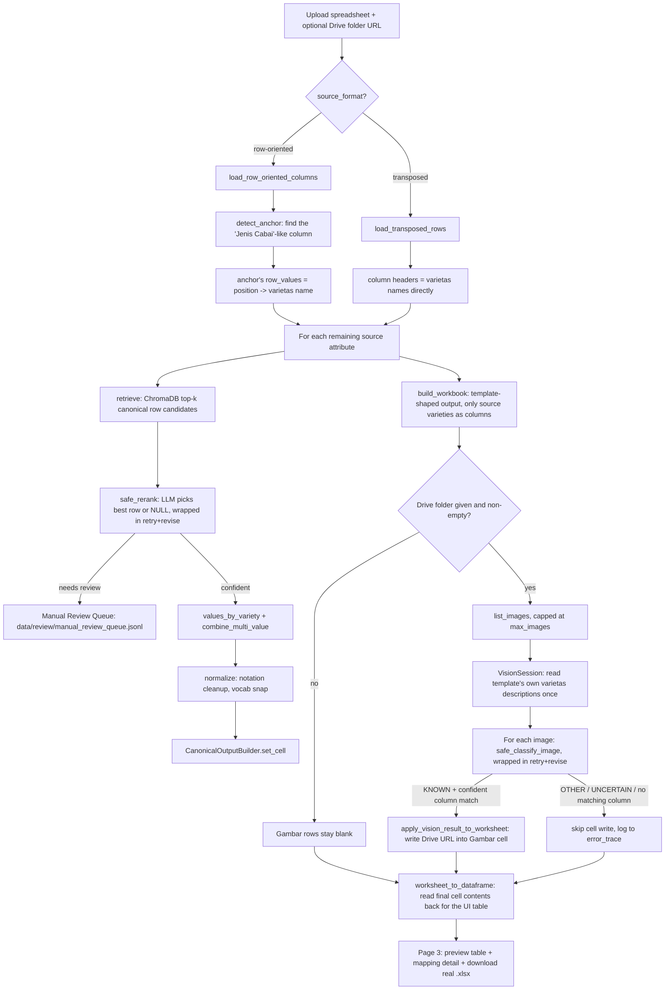

# CABAI-KMS Akuisisi — Project Guide

A single, detailed reference for this project: what it does, how data flows
through it end to end, the full tech stack and why each piece was chosen,
and the role of every folder and file in the repository. `CLAUDE.md` is the
short version for an AI assistant working in this repo; this document is
the long version for a human (or a new contributor) who wants the whole
picture.

Companion documents, each covering one narrower slice in more depth:
- [`PROFILING.md`](PROFILING.md) — raw inspection of every input asset (the
  canonical template's exact shape, the two real/synthetic sample files,
  the messy value patterns catalogued cell-by-cell).
- [`DESIGN_DECISIONS.md`](DESIGN_DECISIONS.md) — the "why" behind every
  non-obvious modeling choice (domain semantics, Lokasi as a composite
  string, flat Drive listing, the two raw-format variants), each tagged
  FINAL/PROPOSED/OPEN.
- [`OPEN_QUESTIONS.md`](OPEN_QUESTIONS.md) — the historical record of
  questions raised to the user and how they were resolved.
- [`DRIVE_SETUP.md`](DRIVE_SETUP.md) — step-by-step Google Cloud service
  account setup for the Drive Crawler.
- [`CHECKPOINTS.md`](CHECKPOINTS.md) — a running log of blueprint
  checkpoints verified against real data/APIs (not mocks), with evidence.

---

## 1. What this system does

**Problem:** field researchers collect chili (*cabai*) varietas
characterization data into spreadsheets with inconsistent, ad-hoc formats
(sometimes varietas as columns, sometimes as rows; decimal commas; range
dashes written three different ways; multi-value cells; free-text colors
instead of an RHS color code; ...), plus a flat, unsorted folder of plant
photos on Google Drive. All of it needs to end up as clean rows in one
canonical template.

**Approach:** rather than hand-writing a parser per spreadsheet format,
LLM/LVM agents do the semantic work — matching a messy source column to
the right canonical row, normalizing its values, and classifying which
plant part + varietas a photo shows — while deterministic Python code does
everything that doesn't need judgment (I/O, anchor-column detection by
embedding similarity, writing cells, retry/rate-limit bookkeeping). A human
stays in the loop for anything the agents aren't confident about, via a
Manual Review Queue rather than the pipeline silently guessing.

**Output:** a real `.xlsx` workbook shaped *exactly* like
`data/canonical/template_kanonik.xlsx` — same canonical rows (read
dynamically, never hardcoded), but with varietas **columns** taken from
whatever the uploaded source file actually contains (not the template's
original 10 reference varieties). A canonical row nothing mapped to for a
given varietas is left blank; a varietas with no Drive photos simply has
blank `Gambar *` cells.

## 2. Architecture — 5 layers

```
1. Data & Schema        data/, src/schema/
2. Ingestion            src/agents/schema_matching/source_parsing.py, anchor.py
                        src/agents/drive_crawler.py
3. Agents               src/agents/  (+ src/llm/ as a cross-cutting provider layer)
4. Orchestration         src/orchestrator/, src/reliability/
   & Reliability
5. Interface             src/ui/, eval/
   & Evaluation
```

1. **Data & Schema** — the canonical template, gold labels, and
   `row_domains.yaml` (row → domain lookup; domain is *looked up*, never
   predicted by any agent — see [DESIGN_DECISIONS.md (b)](DESIGN_DECISIONS.md)).
2. **Ingestion** — raw-format detection and normalization into a common
   intermediate representation (`ParsedAttribute`): variant (i) transposed
   vs. (ii) row-oriented spreadsheets (anchor-column detection required for
   (ii)), and the Drive image crawler (flat file list — part is inferred
   from image content + filename, never folder structure).
3. **Agents** — LLM-driven extraction/standardization per canonical row
   (schema matching + normalization), and an image-to-plant-part
   classification agent (vision).
4. **Orchestration & Reliability** — a LangGraph graph coordinating agent
   calls with retry/rate-limiting policy and a verify-then-revise loop; a
   separate, currently-parallel Streamlit pipeline runner that calls the
   same agents directly for the UI's synchronous request/response flow.
5. **Interface & Evaluation** — a Streamlit review UI for human-in-the-loop
   correction/inspection, and a review-harness script that runs the real
   schema-matching pipeline against a sample file for manual grading.

`src/llm/` is a cross-cutting provider abstraction (Groq / Gemini / Ollama
/ OpenRouter clients) used by layer 3's agents — not a layer of its own.

### Two parallel "orchestrators" — why

There are, deliberately, two different things that run the pipeline:

- **`src/orchestrator/graph.py`** — a real LangGraph `StateGraph` with
  SQLite checkpointing, built in Fase 2 as stub nodes (dummy-but-valid
  contract objects, no network calls) to prove out the graph shape,
  conditional verify/retry/manual-review routing, and checkpoint/resume —
  independent of whether any real agent existed yet.
- **`src/ui/pipeline_runner.py`** — the function the Streamlit UI actually
  calls. It wires together the *real* agents (schema matching, Drive
  crawler, vision classification, tabular update) directly, wrapped in the
  Fase 7 reliability layer, as one synchronous Python function — no graph
  needed for a single-request/response UI flow. It additionally calls
  `run_pipeline()` from `graph.py` purely so the UI's checkpoint debugger
  (Page 3) has a real thread/checkpoint to open; that stub run does not
  affect the actual output the user downloads.

If a future fase moves the real agents to run *inside* `graph.py`'s nodes
(a genuine async/long-running/multi-worker execution), `pipeline_runner.py`
is the reference for what each node's real logic should look like.

## 3. Canonical schema shape (today)

Read dynamically at runtime from `data/canonical/template_kanonik.xlsx`,
never hardcoded — but as of this writing:

- **N = 60 rows.** Rows 1–55 are morphological characters; row 56 is
  `Lokasi`; rows 57–60 are `Gambar Daun` / `Gambar Batang` / `Gambar Buah`
  / `Gambar Bunga`.
- **6 domains:** `vegetatif`, `daun`, `bunga`, `buah`, `biji`, `lokasi`
  (derived from `src/schema/row_domains.yaml`, matched by row **label
  text**, not row number — see [PROFILING.md §1.1](PROFILING.md) for the
  full row-by-row table).
- **Template's own 10 reference varietas columns** (Gendot, Kopay,
  Katokkon, Cabai merah keriting Jotanbar, Cabai merah keriting akar, Cabai
  rawit NTB, Cabai landung, Cabai tanjung, Domba, Cabai H) are used only as
  a source of `contoh_nilai` (example values for prompting/vocabulary
  snapping) and as the Vision Agent's dynamic knowledge base — **not**
  copied into pipeline output. Output columns come from whatever varietas
  the uploaded source file names.

## 4. End-to-end pipeline flow (Streamlit UI path)

This is what `src/ui/pipeline_runner.py:run_pipeline_ui()` actually does,
step by step, for one uploaded file:



Narrated:

1. **Parse.** Row-oriented files go through `load_row_oriented_columns`
   (two-row hierarchical header: an optional section row, forward-filled,
   plus a real field-name row); transposed files go through
   `load_transposed_rows` (varietas already are the column headers). Both
   return a flat list of `ParsedAttribute` with `row_values` positionally
   aligned across every attribute from the same call — this alignment is
   what later lets a raw value be traced back to "which varietas does this
   belong to".
2. **Anchor detection** (row-oriented only). Embeds each candidate column's
   **header text alone** with a multilingual sentence-transformer and
   ranks cosine similarity against reference phrases for the concept
   "varietas cabai / aksesi". The highest-scoring column above a 0.7
   threshold is the anchor (e.g. "Jenis Cabai"); below threshold, it
   escalates rather than guessing. (Transposed format skips this entirely
   — varietas identity is already the column headers.)
3. **Schema matching**, per non-anchor attribute:
   - **Retrieve** (ChromaDB, cosine similarity) the top-k canonical row
     candidates for a query built from the attribute's name + structural
     context + up to 10 sample values + a heuristically detected data type
     (numerik/kategorik/tekstual).
   - **Rerank** (Groq LLM via `instructor`, constrained to the
     `SchemaMapping` Pydantic contract): pick exactly one of the k
     candidates, or `NULL` if none confidently fits. Wrapped in
     `safe_rerank` — retries transient provider errors, revises on
     contract-invalid output, and routes low-confidence/NULL mappings to
     the Manual Review Queue (JSONL, append-only).
4. **Value assembly.** For a confidently-mapped attribute, its raw values
   are grouped by varietas (`values_by_variety`, using the anchor's/
   transposed header's position alignment), multiple raw values for the
   same (row, varietas) pair are joined (`combine_multi_value`, `"; "`
   separator), then **normalized** (`normalize()`): empty tokens → `None`,
   decimal comma → dot, range dash unified to `"--"`, multi-value separator
   unified, whitespace collapsed, categorical values snapped to the target
   row's own example vocabulary on exact case-insensitive match. Ambiguous
   values (garbled numbers) are left as-is with a trace note, never
   guessed.
5. **Build the output workbook.** `CanonicalOutputBuilder` accumulates
   `(canonical_row, varietas) -> value` pairs, then `build_workbook()`
   loads a **copy** of the template, fully clears its old reference
   columns (both headers and values), writes the source-derived varietas
   headers, and writes every accumulated value — everything unmapped stays
   blank.
6. **Vision classification** (only if a Drive folder was given and isn't
   empty). `VisionSession` reads the template's own already-filled-in
   varietas columns once per session as the dynamic knowledge source, then
   for each image (capped at `max_images`, default 5): download bytes →
   Gemini call (via `safe_classify_image`, same retry+revise wrapping) →
   `VisionResult` (plant part + KNOWN/OTHER/UNCERTAIN + matched varietas).
   Only `KNOWN` results get written to a cell, and only if the matched
   varietas name matches an existing output column — never a new column.
   Writes go straight onto the **same worksheet** already built in step 5,
   reusing `src/agents/tabular_update.py`'s cell-writing logic exactly
   (Fase 6's own module, not reimplemented).
7. **Finalize.** The worksheet's actual current cell contents are read back
   into a DataFrame (`worksheet_to_dataframe` — single source of truth,
   post schema-matching *and* post vision writes, so nothing can drift
   between two separately-tracked representations), the workbook is saved
   to an in-memory buffer, and (side effect only) Fase 2's stub
   orchestrator graph is run once so the checkpoint debugger has real data.

## 5. End-to-end pipeline flow (review-harness script path)

`eval/review_schema_matching.py` runs the same parse → anchor → retrieve →
rerank → normalize sequence as steps 1–4 above, directly against the real
Fase 3a–3f modules (no reliability wrapping, no vision, no output
workbook) — its only job is producing a human-reviewable Excel table
(`data/gold/schema_matching_review.xlsx`, sorted lowest-confidence first)
with blank `gold_row` / `is_correct` / `catatan` columns for a human to
fill in by hand afterward.

## 6. Tech stack

| Concern | Library | Why / notes |
|---|---|---|
| Spreadsheet I/O | `pandas` + `openpyxl` | `openpyxl` for cell-level read/write (needed to preserve exact template shape); `pandas` for the tabular views shown in the UI. |
| Data contracts | `pydantic` (v2) | `SchemaMapping`, `VisionResult`, `ImageMetadata` — validated shapes for every agent output; `target_domain` is a `computed_field`, never LLM-settable. |
| Env config | `python-dotenv` | `.env` loaded once at each provider module's import time (not per-call) — see the "load once" note in §8. |
| Domain/alias data | `pyyaml` | `row_domains.yaml`, `row_aliases.yaml`. |
| Orchestration graph | `langgraph` + `langgraph-checkpoint-sqlite` | `StateGraph` with SQLite-backed checkpointing for `src/orchestrator/graph.py`; not (yet) used to run the real agents — see §4's note on the two parallel orchestrators. |
| Retrieval | `chromadb` (`PersistentClient`, cosine `hnsw:space`) + `sentence-transformers` (`paraphrase-multilingual-MiniLM-L12-v2`) | Multilingual (Indonesian + English) embedding model for both schema-row retrieval and anchor-column detection, sharing one index/cache. |
| (transitive) | `torchvision` | Not imported directly by this project's code — but `sentence-transformers`' resolved `transformers` version eagerly imports `torchvision.transforms.v2` on model load even for a pure text model. Without it: `ModuleNotFoundError` on first embedding-model load. Confirmed pairing: `torch==2.13.0` + `torchvision==0.28.0`. |
| Constrained LLM/LVM output | `instructor` | Wraps an OpenAI-compatible client so the model's output is parsed straight into a Pydantic model (`SchemaMapping`, `VisionResult`), retried internally on schema mismatch. |
| Text LLM providers | `groq` (primary, `llama-3.3-70b-versatile`) + `openai`-compatible Ollama (`llama3.1:8b`, fallback) | `call_with_fallback()` in `src/llm/providers.py`. |
| Vision/LVM providers | Gemini via OpenAI-compat endpoint (`gemini-flash-latest`) as primary, no fallback of its own; optional second voter Qwen2.5-VL-72B via OpenRouter → Ollama Qwen2.5-VL-7B fallback, only for consensus mode | `src/llm/vision_providers.py`. Model note: `gemini-2.5-flash` (the brief's named model) returns 404 for newly-provisioned API keys — `gemini-flash-latest` is used, configurable via `GEMINI_MODEL_NAME`. |
| Retry | `tenacity` | Exponential backoff, `retry_if_exception_type` filtered to transient provider errors only — never contract/validation failures. |
| Rate limiting | `aiolimiter` (`AsyncLimiter`) | Bridged to synchronous call sites via one persistent event loop per `RateLimiter` instance (not `asyncio.run()` per call). |
| Drive access | `google-api-python-client` + `google-auth` | Read-only service account, flat file listing (`'{folder_id}' in parents`), never recurses into subfolders. |
| UI | `streamlit` | 3-page multi-page app; `streamlit.testing.v1.AppTest` for real (non-mocked) page-script tests. |
| Tests | `pytest` | `pyproject.toml` sets `pythonpath=["."]`, `testpaths=["tests"]`, and two custom markers (`indexing`, `llm_fallback_live`). |

Convention (`requirements.txt`'s own header comment): a dependency is only
ever uncommented in the same commit that introduces its first real import
in `src/`.

Deliberately **not** used, with reasons on record: `langchain-core`
(nothing in this project needs its abstractions beyond what `langgraph`
itself provides); `google-genai` (Gemini is reached through its
OpenAI-compatible endpoint instead, so every provider in the project goes
through one consistent `instructor` + OpenAI-client pattern).

## 7. Repository layout

```
.
├── CLAUDE.md                  Short project-convention reference for AI assistants
├── requirements.txt            Active dependency list with per-fase rationale comments
├── pyproject.toml               pytest config (pythonpath, testpaths, markers)
├── .env / .env.example          API keys + Drive/Chroma config (never commit .env)
├── .gitignore
├── credentials.json              Drive service-account key (gitignored)
│
├── data/                          INPUT assets — read-only except gold/review/.chroma
│   ├── canonical/template_kanonik.xlsx   THE canonical template (never overwritten)
│   ├── samples/                   Real + synthetic source spreadsheets for dev/testing
│   ├── gold/                       Generated human-review Excel exports (eval harness output)
│   ├── review/manual_review_queue.jsonl   Append-only Manual Review Queue
│   └── .chroma/                    ChromaDB persistence (gitignored)
│
├── docs/                           All project documentation (this file included)
│   ├── PROJECT_GUIDE.md            (this file)
│   ├── PROFILING.md                 Raw per-file/per-cell data inspection
│   ├── DESIGN_DECISIONS.md          Why every non-obvious modeling choice was made
│   ├── OPEN_QUESTIONS.md            Historical Q&A record with the user
│   ├── DRIVE_SETUP.md               GCP service-account setup walkthrough
│   └── CHECKPOINTS.md               Verified-against-real-data checkpoint log
│
├── src/
│   ├── schema/                     Layer 1: canonical schema + Pydantic contracts
│   │   ├── canonical.py             CanonicalRow, CanonicalSchema, template hashing
│   │   ├── contracts.py              SchemaMapping, VisionResult, ImageMetadata
│   │   ├── state.py                  GlobalState (LangGraph shared state TypedDict)
│   │   ├── row_domains.yaml          Row-label -> domain lookup (source of truth)
│   │   └── row_aliases.yaml          Skeleton for manual alt-label curation
│   │
│   ├── agents/                     Layer 3: LLM/deterministic agents
│   │   ├── schema_matching/          Sub-package, one file per Fase 3 sub-step
│   │   │   ├── indexing.py            ChromaDB indexing of canonical rows
│   │   │   ├── retrieval.py           Top-k candidate retrieval + data-type heuristic
│   │   │   ├── reranking.py            LLM picks the single best candidate (or NULL)
│   │   │   ├── anchor.py               Header-embedding anchor-column detection
│   │   │   ├── review_queue.py         NULL/low-confidence -> Manual Review Queue
│   │   │   ├── normalize.py            Post-mapping value notation cleanup
│   │   │   └── source_parsing.py       Row-oriented / transposed spreadsheet parsing
│   │   ├── drive_crawler.py           Flat Google Drive image listing
│   │   ├── vision_classification.py   Description-grounded plant-part + varietas ID
│   │   └── tabular_update.py           Deterministic: write a VisionResult into a cell
│   │
│   ├── llm/                         Cross-cutting LLM/LVM provider abstraction
│   │   ├── providers.py               Groq -> Ollama text-LLM fallback
│   │   └── vision_providers.py        Gemini (primary) + Qwen consensus voter
│   │
│   ├── orchestrator/                Layer 4: LangGraph graph (stub nodes) + checkpointing
│   │   └── graph.py
│   │
│   ├── reliability/                  Layer 4: retry / rate-limit / verify-revise
│   │   ├── retry.py                    tenacity exponential-backoff wrapper
│   │   ├── rate_limit.py               aiolimiter bridge for sync call sites
│   │   ├── verifier.py                  Generic contract-validation revise loop
│   │   └── wrappers.py                  Composes all three around the real agent calls
│   │
│   └── ui/                          Layer 5: Streamlit review/inspection app
│       ├── app.py                     Page 1 — Input
│       ├── pages/2_Progress.py         Page 2 — Progres (per-agent status, log)
│       ├── pages/3_Hasil.py            Page 3 — Hasil (result inspector, download)
│       ├── state.py                    Typed st.session_state accessors
│       ├── pipeline_runner.py          Wires every agent together for one UI run
│       └── output_builder.py           Builds the template-shaped output workbook
│
├── eval/
│   └── review_schema_matching.py      CLI harness: real pipeline -> human-reviewable Excel
│
└── tests/                            250+ tests, one file per src/ module (pytest)
```

### Directory-by-directory detail

#### `data/` — inputs, read-only by convention

- **`data/canonical/template_kanonik.xlsx`** — the canonical template.
  `Sheet1` is the only meaningful sheet (`Sheet2`/`Sheet3` are empty
  leftovers). Row 1 = header; rows 2–61 = the 60 canonical rows; column A =
  `Nomor`, column B = `Karakter` (the label matching key), columns C–L =
  the template's own 10 reference varietas (used for `contoh_nilai` and as
  the Vision Agent's knowledge base, never copied into pipeline output).
  **Never written to by code** — every module that touches it opens it
  read-only or loads a fresh in-memory copy to build output from.
- **`data/samples/`** — three source-spreadsheet fixtures used throughout
  development and testing: `data_input.xlsx` (real row-oriented, anchor =
  "Jenis Cabai"), `data_input_sintetis_1.xlsx` (row-oriented, but with real
  canonical varietas names so schema-matching output is directly
  eyeballable), `sample_transposed_sintetis.xlsx` (synthetic — no real
  transposed-format sample ever surfaced, so one was fabricated from the
  template's own labels with deliberately messy injected values, per
  `DESIGN_DECISIONS.md` (d)).
- **`data/gold/`** — generated by `eval/review_schema_matching.py`; each
  file is one run's schema-matching output ready for a human reviewer to
  fill in `gold_row`/`is_correct`/`catatan`.
- **`data/review/manual_review_queue.jsonl`** — append-only event log of
  every `SchemaMapping` that needed human attention (NULL target or
  below-threshold confidence). "Current" state of an item is always its
  *latest* line by `item_id` (enqueue/approve/revise each append a new
  line rather than mutating in place).
- **`data/.chroma/`** — ChromaDB's on-disk persistence for the canonical-row
  embedding index (gitignored, rebuilt automatically if missing/stale).

#### `src/schema/` — Layer 1

- **`canonical.py`** — `CanonicalRow` (frozen dataclass: `id`, `label`,
  `domain`, `contoh_nilai`, `alt_labels`, with a `serialize()` method used
  as the ChromaDB document text) and `CanonicalSchema` (the full row list
  plus a `template_hash` used for drift detection, and `varietas`/`cells`
  fields for the *current run's* data — starting empty, never the
  template's own 10). `CanonicalSchema.from_template()` is the standard
  entry point: reads `Sheet1`, derives labels + example values, looks up
  each row's domain from `row_domains.yaml` (warns and marks
  `"unassigned"` if a label has none), and computes the template hash from
  the `(position, label)` sequence.
- **`contracts.py`** — the three Pydantic v2 contracts. `SchemaMapping`
  validates `target_canonical_row` dynamically against whatever rows the
  *currently loaded* `CanonicalSchema` has (never a hardcoded `Literal`),
  and derives `target_domain` as a `computed_field` — the LLM is never
  asked for domain directly. `VisionResult` and `ImageMetadata` are the
  vision-agent and Drive-metadata shapes.
- **`state.py`** — `GlobalState(TypedDict, total=False)`, the shared state
  shape threaded through `src/orchestrator/graph.py`'s LangGraph nodes.
- **`row_domains.yaml`** — the single source of truth for row → domain;
  matched by label text, never row number, so it survives template edits.
- **`row_aliases.yaml`** — user-maintained skeleton for alternate labels a
  source spreadsheet might use for a canonical row (optional; empty file
  is handled gracefully).

#### `src/agents/schema_matching/` — Fase 3, one file per sub-step

- **`indexing.py`** — embeds every canonical row's `serialize()` text with
  `paraphrase-multilingual-MiniLM-L12-v2` and upserts into a ChromaDB
  collection (cosine distance). `ensure_indexed()` is idempotent: a no-op
  if the collection already matches the current template's row count +
  hash + id set, otherwise a full rebuild (never a partial upsert, since
  row ids are positional and could otherwise leave stale trailing ids
  after a template shrink).
- **`retrieval.py`** — builds a query from an attribute's name + structural
  context + up to 10 sample values + a heuristically detected data type
  (`detect_data_type`: ratio of numeric-looking values, else short/small-
  vocabulary → categorical, else textual), then returns the top-k
  (5–10, default 8) nearest canonical rows by cosine distance.
- **`reranking.py`** — one LLM call (via `instructor`, defaulting to
  `call_with_fallback`) that picks exactly one of the retrieved candidates
  or `NULL`, producing a validated `SchemaMapping`. The candidate list and
  system prompt are built here; the actual network call is injected so
  tests never need real network access.
- **`anchor.py`** — for row-oriented sources only: embeds each candidate
  **column header alone** (deliberately not blended with sample values —
  see the module's own docstring for the empirical reason this backfired)
  and ranks cosine similarity against reference phrases for "varietas
  cabai / aksesi". `DEFAULT_THRESHOLD = 0.7`. Below threshold → escalate,
  never guess. Transposed sources skip this (`status="not_required"`).
- **`review_queue.py`** — `needs_review()` (NULL target or below-threshold
  confidence) and the append-only JSONL queue (`enqueue`/`approve`/
  `revise`/`list_pending`). `process_mapping()` is the one-call convenience
  an orchestrator node/UI runner uses: enqueue if needed, return the
  `error_trace` patch explaining why.
- **`normalize.py`** — deterministic, conservative notation cleanup (never
  touches botanical meaning): empty-token detection, decimal comma → dot,
  range dash → `"--"`, multi-value separator → `"; "`, whitespace
  collapse, then case-insensitive exact-match snapping to the target row's
  own `contoh_nilai` vocabulary. A value that "looks numeric" but doesn't
  parse cleanly is left untouched with a trace note — never guessed.
- **`source_parsing.py`** — pure I/O, shared by both `eval/` and `src/ui/`.
  `ParsedAttribute(attribute_name, structural_context, row_values)` keeps
  `row_values` positionally aligned across every attribute from the same
  parse call, which is what lets a later step zip an attribute's values
  against the anchor column's (or the transposed header's) values to know
  which varietas each value belongs to. `load_row_oriented_columns()`
  handles the two-row hierarchical header (forward-filled section row +
  real field row); `load_transposed_rows()` finds the header row (first
  row whose first cell is `"Karakter"`) and returns `(attributes,
  variety_names)`.

#### `src/agents/` — the rest (Fase 4–6)

- **`drive_crawler.py`** — read-only service-account auth, lists direct
  children only of the target folder (`'{folder_id}' in parents` — never
  recurses; a stray subfolder is skipped, not walked into), filters to
  `image/*` MIME types, paginates automatically. `normalize_folder_id()`
  accepts either a bare id or a pasted Drive share URL.
- **`vision_classification.py`** — `VisionSession` reads the template's own
  filled-in varietas columns once (`load_variety_descriptions`) and reuses
  the resulting knowledge-source text for every image classified through
  that session (the practical meaning of "prompt caching" here — see the
  module docstring for why Gemini's native server-side context cache isn't
  used instead: it isn't reachable through the OpenAI-compatible bridge
  `instructor` uses, and a consistent provider pattern across the whole
  project was preferred over one exception). Filename text is only ever an
  auxiliary hint fed into the prompt — nothing in this module inspects the
  model's output and overrides it based on filename after the fact.
  Optional `consensus=True` mode adds a second voter (Qwen2.5-VL) and
  reconciles agreement/disagreement (`_combine_consensus`).
- **`tabular_update.py`** — the only agent module with **no LLM call**.
  Writes at most one cell per call: the intersection of the `Gambar *` row
  matching `VisionResult.identified_part` and the column matching
  `matched_variety`. Only `classification_status == "KNOWN"` is ever
  written; `OTHER`/`UNCERTAIN` are surfaced via `error_trace` instead. If
  the matched varietas doesn't correspond to an existing column, the
  update is refused (no column is ever silently added) and reported via
  `TabularUpdateResult`, never raised as an exception (an unmatched
  variety/row is an expected, everyday outcome, not a bug). Repeated
  references to the same cell are appended (`"; "` separator) and
  deduplicated, matching `normalize.py`'s convention.

#### `src/llm/` — cross-cutting provider abstraction

- **`providers.py`** — `call_with_fallback()`: Groq (`llama-3.3-70b-versatile`)
  first, then local Ollama (`llama3.1:8b`) if Groq raises for any reason.
  Both go through `instructor` for constrained decoding. `LLMCallError` if
  both fail. `.env` is loaded once at import (not per-call), so a
  caller/test that deletes an env var doesn't get it silently repopulated.
- **`vision_providers.py`** — `call_gemini()`: the always-used primary,
  no fallback of its own (per the brief). `call_second_voter()`: OpenRouter
  Qwen2.5-VL-72B → local Ollama Qwen2.5-VL-7B, used only when
  `VisionSession(consensus=True)`. `VisionCallError` normalizes every
  failure mode to one exception type.

#### `src/orchestrator/` — Layer 4, the LangGraph graph

- **`graph.py`** — `build_graph()` assembles a `StateGraph(GlobalState)`
  with stub nodes (`schema_matching → drive_crawler →
  vision_classification → [conditional: retry/manual_review/continue] →
  tabular_update → finalization`), a real SQLite-backed checkpointer
  (`_sqlite_checkpointer`, with an explicit allow-list of contract types
  the msgpack serializer is permitted to (de)serialize), and `run_pipeline`
  / `resume_pipeline` entry points for a fresh run vs. continuing an
  interrupted one. `route_after_vision` is a genuine conditional edge —
  routes by `error_trace` length and the last classification's confidence,
  never by re-running a model "to see if it feels ok". See §4's note: this
  module's nodes are still stubs; the real agent wiring for a UI request
  lives in `src/ui/pipeline_runner.py` instead.

#### `src/reliability/` — Layer 4, cross-cutting robustness

- **`retry.py`** — `with_retry()` (decorator factory) / `run_with_retry()`
  (plain-call form) wrap a callable with `tenacity` exponential backoff,
  filtered to specific transient exception types only — deliberately *not*
  for contract/validation failures, which need a different remedy (revise,
  not retry-unchanged).
- **`rate_limit.py`** — `RateLimiter` wraps `aiolimiter.AsyncLimiter` behind
  one persistent event loop per instance (`acquire_sync()`), so every
  currently-synchronous provider call site can still respect a token-bucket
  rate limit without needing `asyncio.run()` per call.
- **`verifier.py`** — the generic Verifier/Critic: `verify_with_revision()`
  calls a zero-arg closure, and on a revisable exception (contract
  violation), calls it again up to `max_revisions` times before giving up.
  Deliberately state-schema-agnostic (`AgentState = MutableMapping[str,
  Any]`, **not** `GlobalState`) — this is the fix for a real bug where
  LangGraph inspects a node/edge callable's *own* parameter annotation to
  decide which state keys it can see, silently stripping any key the
  annotated type doesn't declare. Also exposes `make_agent_node` /
  `make_verifier_node` / `make_verifier_router` so the same logic is
  directly usable as real LangGraph nodes+router (proven in
  `tests/test_verifier.py` by building and running an actual compiled
  graph through them, not just calling the plain function).
- **`wrappers.py`** — where retry + rate-limit + verify-revise actually get
  composed around the two real network-calling agents:
  `safe_classify_image` (download retried but never revised; classification
  call retried on `VisionCallError`, revised on contract failure; a
  successful `UNCERTAIN` result is still returned but flagged) and
  `safe_rerank` (LLM call retried on `LLMCallError`, revised on contract
  failure; delegates NULL/low-confidence handling to
  `review_queue.process_mapping` rather than reimplementing it). Both
  `VISION_REVISABLE_EXCEPTIONS` and `SCHEMA_MATCHING_REVISABLE_EXCEPTIONS`
  include the provider's own error type (`VisionCallError`/`LLMCallError`)
  specifically because an *exhausted* `run_with_retry` re-raises that same
  exception, which must still be caught by the *outer* revise loop or it
  crashes the whole pipeline run over one attribute/image — a real bug hit
  against an exhausted Groq daily quota, not a hypothetical, and now
  covered by regression tests.

#### `src/ui/` — Layer 5, the Streamlit app

Run with `streamlit run src/ui/app.py`. Streamlit auto-discovers
`src/ui/pages/*.py` as additional sidebar pages.

- **`app.py`** (Page 1 — Input) — file uploader (`.xlsx`/`.csv`), a
  `source_format` radio (row-oriented / transposed), an optional Drive
  folder URL/ID text input, and a "▶️ Jalankan Pipeline" button that saves
  the upload to a temp file, calls `run_pipeline_ui()` with a progress
  callback streamed live via `st.empty()`, and stores the `PipelineRunResult`
  into session state for the other two pages to read.
- **`pages/2_Progress.py`** (Page 2 — Progres) — per-agent status metrics
  (OK/GAGAL + the human-readable status string), a validation-status
  summary (`error_trace` count, expandable detail), and the raw streaming
  log from the last run.
- **`pages/3_Hasil.py`** (Page 3 — Hasil) — the canonical-shaped result
  table (`canonical_df`), the schema-mapping detail table with a
  reasoning-inspector selectbox, the vision-classification results table
  (if any images were processed), a checkpoint debugger (opens
  `orchestrator/graph.py`'s SQLite checkpoints for the stub run's
  thread_id), and the download button — which serves `workbook_bytes`
  directly (the actual saved workbook from the real run, not a
  freshly-rebuilt one).
- **`state.py`** — typed accessors over `st.session_state` (`has_result`,
  `get_result`/`set_result`, log helpers, running flag, last-inputs cache)
  so the three page scripts never scatter raw string-keyed session-state
  access.
- **`pipeline_runner.py`** — see §4 above for the full step-by-step flow.
  `PipelineRunResult` is the dataclass every page reads from:
  `mapping_df`, `canonical_df`, `workbook_bytes`, `vision_rows`,
  `agent_status`, `checkpoint_thread_id`, `error_trace`.
- **`output_builder.py`** — `CanonicalOutputBuilder` accumulates
  `(canonical_row, varietas) -> value` (appending with `"; "` rather than
  overwriting when two different source attributes map to the same row/
  varietas pair) and `build_workbook()` materializes it: loads a **copy**
  of the template, fully clears old reference columns (must assign
  `.value = None` directly — `cell(value=None)` is a documented openpyxl
  no-op, not a clear), writes the source-derived headers + values.
  `worksheet_to_dataframe()` reads the worksheet's actual current cell
  contents back out — the single source of truth for what the UI shows,
  post both schema-matching *and* vision writes. `values_by_variety()` /
  `combine_multi_value()` are the position-alignment + multi-value-merge
  helpers `pipeline_runner.py` uses per attribute.

#### `eval/`

- **`review_schema_matching.py`** — CLI: `python eval/review_schema_matching.py
  [--file ...] [--format row-oriented|transposed] [--sheet ...] [--k ...]
  [--output ...]`. Runs the real Fase 3a–3f pipeline over one sample file
  and writes `data/gold/schema_matching_review.xlsx` sorted lowest-
  confidence-first, with blank `gold_row`/`is_correct`/`catatan` columns
  for a human reviewer to fill in. Never modifies/wraps/reimplements any
  agent logic — a pure harness.

#### `tests/`

One file per `src/` module (19 files, 250+ tests), run with `pytest` from
the project root (`pyproject.toml` sets `pythonpath=["."]` and
`testpaths=["tests"]`). Two custom markers: `indexing` (first run needs
network to download the HF embedding model, cached after) and
`llm_fallback_live` (attempts a real, expected-to-fail localhost
connection to a non-running Ollama server, ~15–20s — exercises the
fallback path's failure branch honestly rather than mocking it away).
`test_ui.py` uses Streamlit's own `AppTest` framework to run each page
script for real (not mocked), with a `default_timeout=30` because
`app.py`'s import chain pulls in the full stack (`torch`, `transformers`,
`langgraph`, `chromadb`, the Google API client, ...) which reliably
exceeds `AppTest`'s default 3s timeout on a cold run.

## 8. Cross-cutting conventions worth knowing before touching this code

These are enforced by `CLAUDE.md` and consistently followed everywhere:

- **Never hardcode N** (the canonical row count). Every place that needs it
  reads `len(CanonicalSchema.from_template().rows)` (currently 60) at
  runtime.
- **Match canonical rows by label text (trimmed), never row number/index.**
  Row order and count can change when the user edits the template; only
  the label is a stable key.
- **Domain is looked up, never predicted.** Every domain reference goes
  through `row_domains.yaml`; the valid domain set is derived from that
  file's unique values, never a hardcoded enum.
- **`data/` files are inputs.** Anything under `data/` except
  `data/gold/`, `data/review/`, and `data/.chroma/` is read-only from
  code's perspective — read it, never overwrite it without an explicit,
  user-approved reason. `output_builder.build_workbook()` always loads a
  fresh **copy** of the template rather than mutating the file on disk.
- **`"; "` is the one multi-value separator**, used consistently by
  `normalize.py`, `tabular_update.py`, and `output_builder.py` — chosen
  once, reused everywhere, rather than each module inventing its own.
- **`load_dotenv()` runs once, at each provider module's import time**, not
  inside the functions that use the env vars — so a caller/test that
  clears an env var for a specific test doesn't get it silently
  repopulated by a later call into the same module.
- **A value/mapping/classification that isn't confidently resolvable is
  never guessed.** It's either left exactly as given with a trace note
  (`normalize.py`), routed to the Manual Review Queue
  (`review_queue.py`), or simply not written to a cell
  (`tabular_update.py`) — the `error_trace` list is the one consistent
  channel every one of these paths reports through.
- **Big design decisions get raised explicitly**, not silently guessed —
  see `docs/OPEN_QUESTIONS.md` for the historical record of exactly this
  happening (domain semantics, Lokasi's shape, the synthetic transposed
  fixture).

## 9. Running things

### Setup

```bash
python -m venv .venv
source .venv/Scripts/activate      # Git Bash on Windows
# or: .venv\Scripts\activate       # cmd/PowerShell
pip install -r requirements.txt
cp .env.example .env                # then fill in GROQ_API_KEY, GOOGLE_API_KEY, ...
```

Google Drive access additionally needs a service account — see
[`DRIVE_SETUP.md`](DRIVE_SETUP.md) for the full walkthrough, then set
`GOOGLE_DRIVE_CREDENTIALS_PATH` and `GOOGLE_DRIVE_FOLDER_ID` in `.env`.

### Streamlit UI

```bash
streamlit run src/ui/app.py
```

Upload a spreadsheet from `data/samples/` (or your own, matching one of
the two supported shapes), pick the matching `source_format`, optionally
paste a Drive folder URL, and run. Page 2 shows live/streamed progress and
per-agent status; Page 3 shows the result table and the download button.

### Review harness (schema matching only, no UI)

```bash
python eval/review_schema_matching.py
python eval/review_schema_matching.py --file data/samples/sample_transposed_sintetis.xlsx --format transposed
```

### Tests

```bash
pytest
```

First run of anything touching `indexing`/`retrieval`/`anchor` downloads
the embedding model from Hugging Face (cached after); expect that one to
be slower the first time.

## 10. Known external constraint

Groq's free-tier daily token quota (100,000 TPD) can be exhausted during
heavy testing/usage — this is expected to reset on Groq's own schedule and
is not a code issue. The pipeline degrades gracefully when this happens
(the affected attribute/image is skipped and logged to `error_trace`
instead of crashing the whole run) — see `src/reliability/wrappers.py`'s
module docstring and its regression tests in `tests/test_reliability_wrappers.py`
for exactly how.
